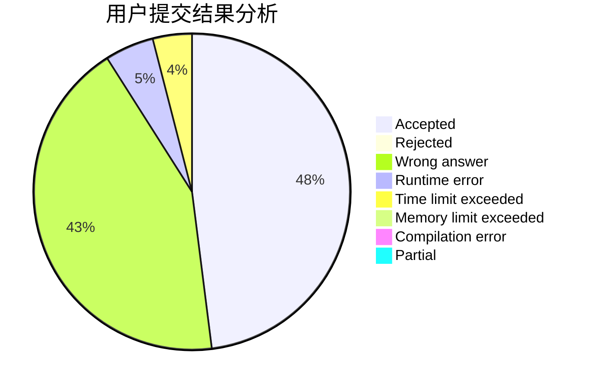
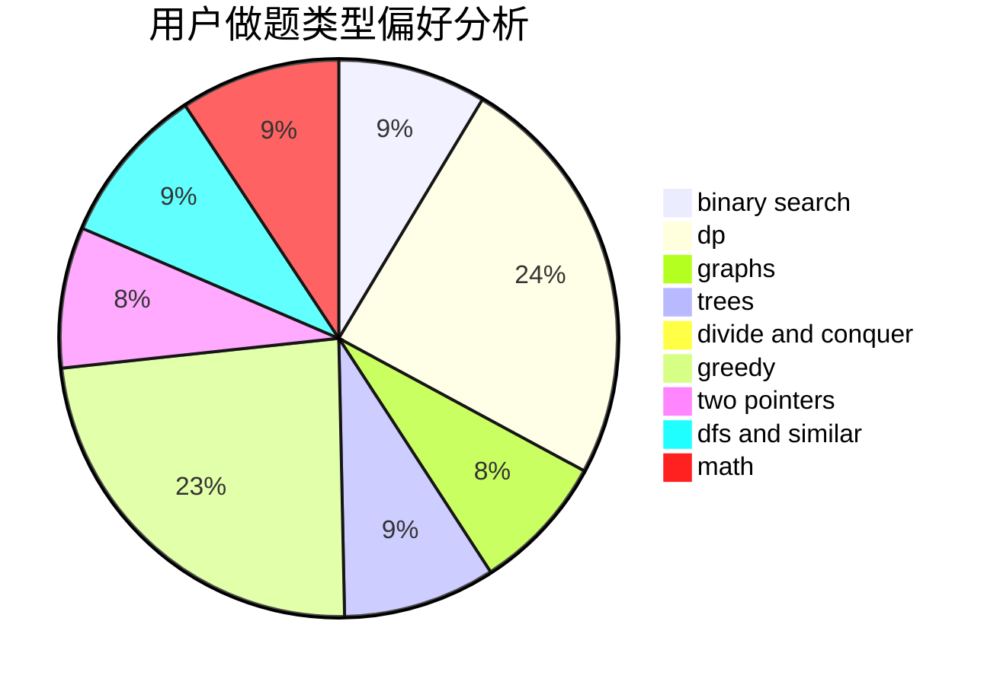

# ziwen

<!-- tabs:start -->

#### **用户提交结果分析**

#### **用户做题类型偏好分析**

<!-- tabs:end -->
# 推荐题目
[1243E](https://codeforces.com/contest/1243/problem/E)
[875D](https://codeforces.com/contest/875/problem/D)
[1161E](https://codeforces.com/contest/1161/problem/E)
[1347C](https://codeforces.com/contest/1347/problem/C)
[1046H](https://codeforces.com/contest/1046/problem/H)
[452B](https://codeforces.com/contest/452/problem/B)
[837F](https://codeforces.com/contest/837/problem/F)
[1042E](https://codeforces.com/contest/1042/problem/E)
[666D](https://codeforces.com/contest/666/problem/D)
[609A](https://codeforces.com/contest/609/problem/A)
