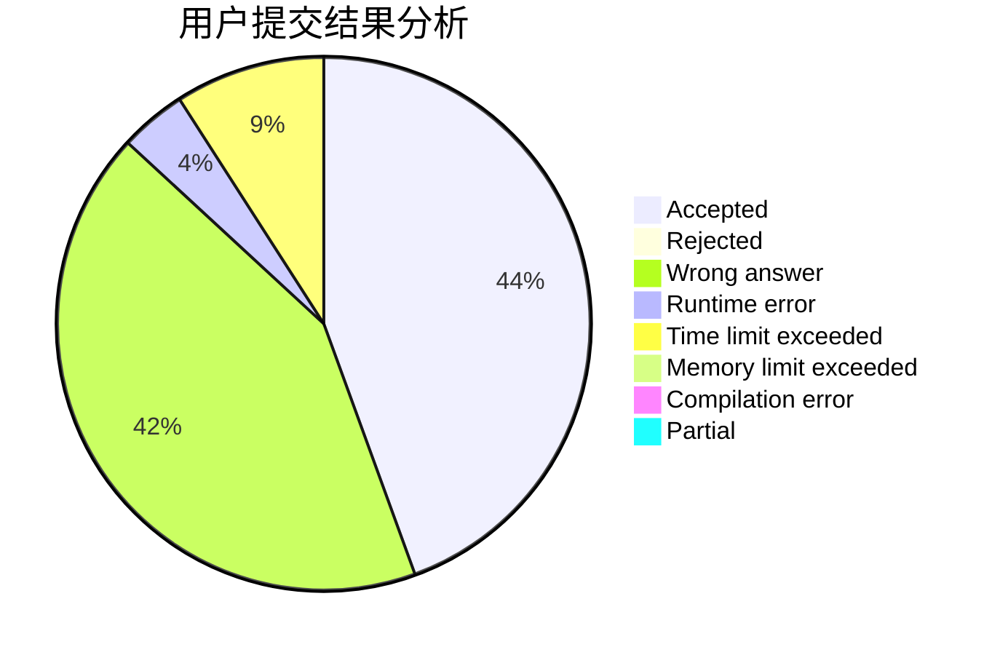
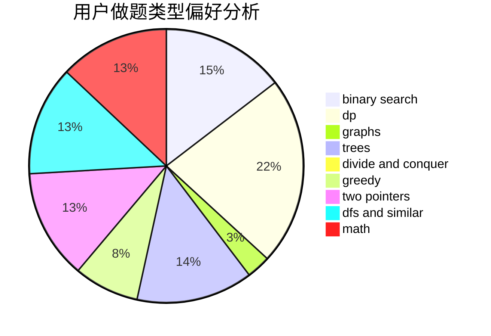

# zj20171

<!-- tabs:start -->

#### **用户提交结果分析**

#### **用户做题类型偏好分析**

<!-- tabs:end -->
# 推荐题目
[1423K](https://codeforces.com/contest/1423/problem/K)
[1225A](https://codeforces.com/contest/1225/problem/A)
[46A](https://codeforces.com/contest/46/problem/A)
[1028H](https://codeforces.com/contest/1028/problem/H)
[911B](https://codeforces.com/contest/911/problem/B)
[1264A](https://codeforces.com/contest/1264/problem/A)
[613A](https://codeforces.com/contest/613/problem/A)
[991B](https://codeforces.com/contest/991/problem/B)
[1164N](https://codeforces.com/contest/1164/problem/N)
[1143F](https://codeforces.com/contest/1143/problem/F)
