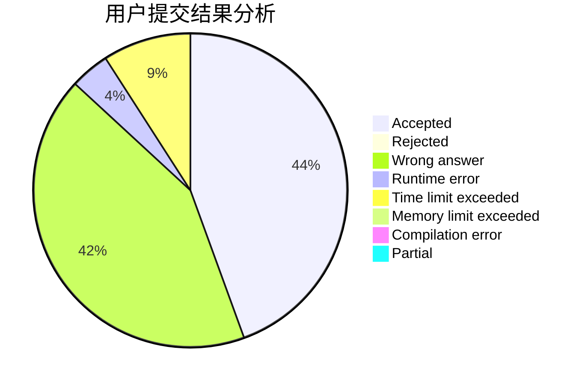
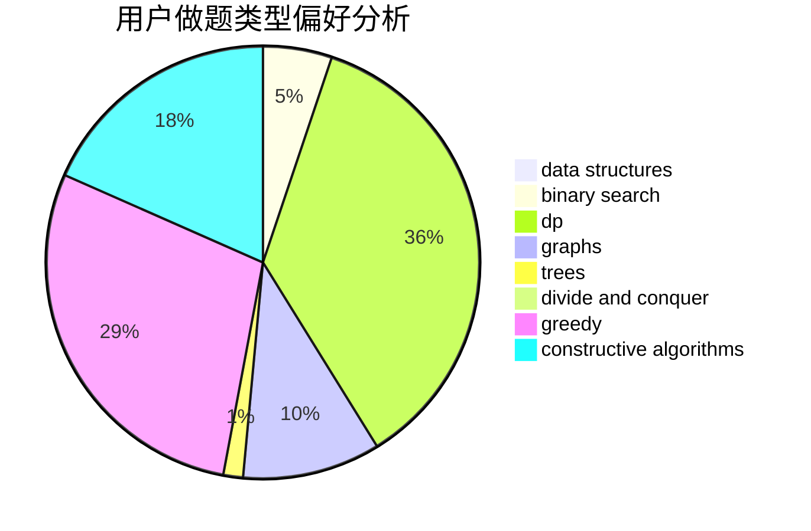
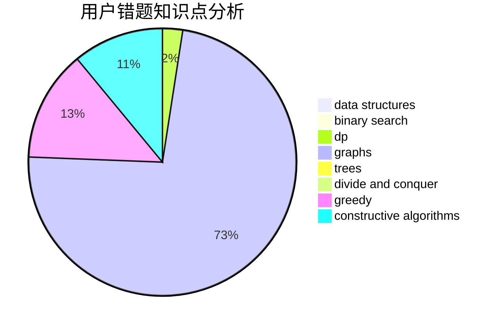

# zj20171

<!-- tabs:start -->

#### **用户提交结果分析**

#### **用户做题类型偏好分析**

#### **用户错题知识点分析**

<!-- tabs:end -->
# 推荐题目
[1416A](https://codeforces.com/contest/1416/problem/A)		binary search,
                        data structures,
                        implementation,
                        two pointers		  
[1217D](https://codeforces.com/contest/1217/problem/D)		constructive algorithms,
                        dfs and similar,
                        graphs		  
[449D](https://codeforces.com/contest/449/problem/D)		bitmasks,
                        combinatorics,
                        dp		  
[1028D](https://codeforces.com/contest/1028/problem/D)		combinatorics,
                        data structures,
                        greedy		  
[893B](https://codeforces.com/contest/893/problem/B)		brute force,
                        implementation		  
[1257A](https://codeforces.com/contest/1257/problem/A)		greedy,
                        math		  
[596A](https://codeforces.com/contest/596/problem/A)		geometry,
                        implementation		  
[977D](https://codeforces.com/contest/977/problem/D)		dfs and similar,
                        math,
                        sortings		  
[1163A](https://codeforces.com/contest/1163/problem/A)		greedy,
                        math		  
[1141F1](https://codeforces.com/contest/1141F/problem/1)		greedy		  
