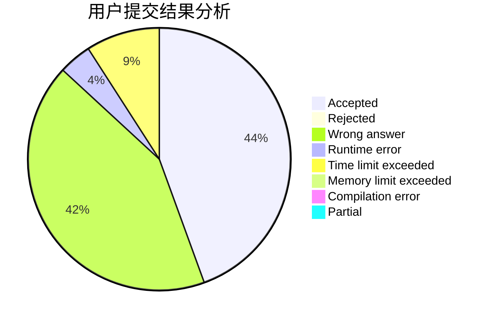
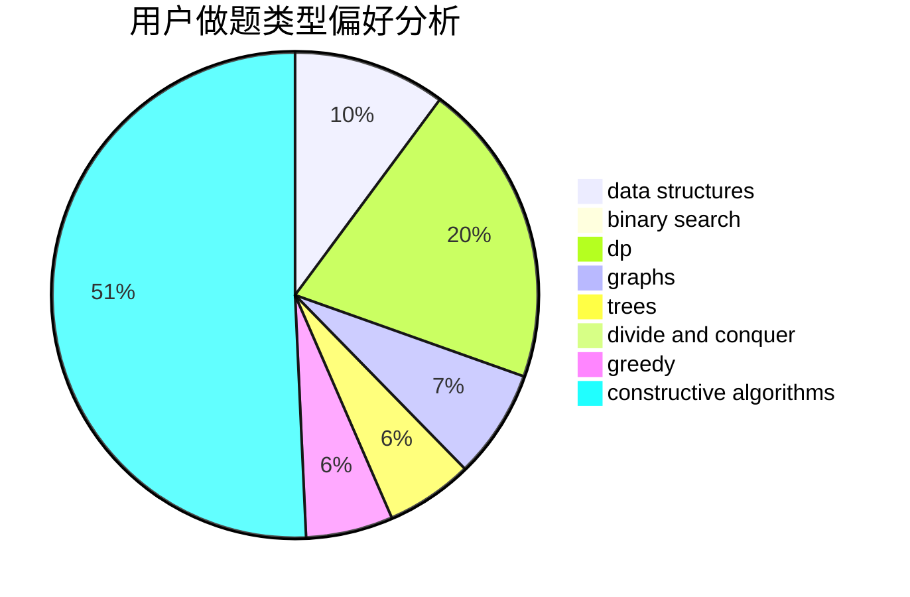
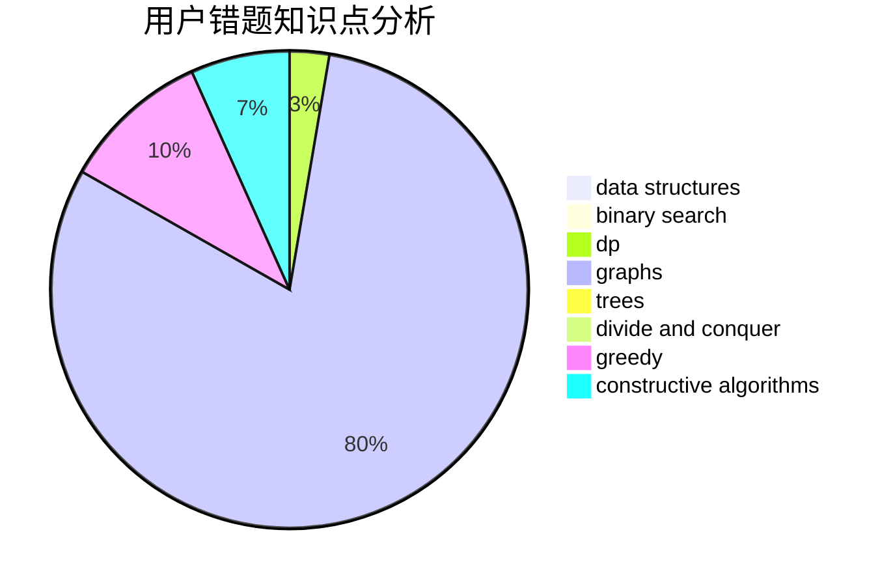

# zj20171

<!-- tabs:start -->

#### **用户提交结果分析**

#### **用户做题类型偏好分析**

#### **用户错题知识点分析**

<!-- tabs:end -->
# 推荐题目
[1423K](https://codeforces.com/contest/1423/problem/K)		binary search,
                        math,
                        number theory,
                        two pointers		  
[1225A](https://codeforces.com/contest/1225/problem/A)		math		  
[46A](https://codeforces.com/contest/46/problem/A)		brute force,
                        implementation		  
[1028H](https://codeforces.com/contest/1028/problem/H)		math		  
[911B](https://codeforces.com/contest/911/problem/B)		binary search,
                        brute force,
                        implementation		  
[1264A](https://codeforces.com/contest/1264/problem/A)		greedy,
                        implementation		  
[613A](https://codeforces.com/contest/613/problem/A)		binary search,
                        geometry,
                        ternary search		  
[991B](https://codeforces.com/contest/991/problem/B)		greedy,
                        sortings		  
[1164N](https://codeforces.com/contest/1164/problem/N)		dsu,graphs,sortings,trees		  
[1143F](https://codeforces.com/contest/1143/problem/F)		dsu,graphs,sortings,trees		  
