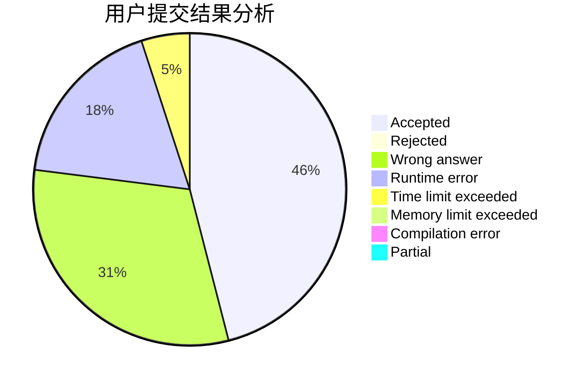
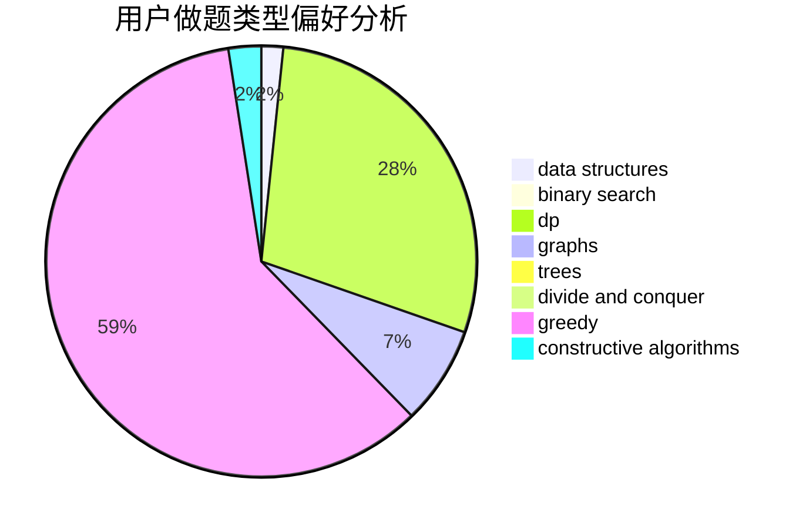

# zj713300

<!-- tabs:start -->

#### **用户提交结果分析**

#### **用户做题类型偏好分析**

#### **用户错题知识点分析**

<!-- tabs:end -->
# 推荐题目
[1513F](https://codeforces.com/contest/1513/problem/F)		brute force,
                        constructive algorithms,
                        data structures,
                        sortings		  
[753C](https://codeforces.com/contest/753/problem/C)		brute force,
                        constructive algorithms,
                        interactive		  
[1315C](https://codeforces.com/contest/1315/problem/C)		greedy		  
[815E](https://codeforces.com/contest/815/problem/E)		binary search,
                        constructive algorithms,
                        implementation		  
[424D](https://codeforces.com/contest/424/problem/D)		binary search,
                        brute force,
                        constructive algorithms,
                        data structures,
                        dp		  
[1200B](https://codeforces.com/contest/1200/problem/B)		dp,
                        greedy		  
[1054B](https://codeforces.com/contest/1054/problem/B)		implementation		  
[1096B](https://codeforces.com/contest/1096/problem/B)		combinatorics,
                        math,
                        strings		  
[1185B](https://codeforces.com/contest/1185/problem/B)		implementation,
                        strings		  
[1187A](https://codeforces.com/contest/1187/problem/A)		math		  
