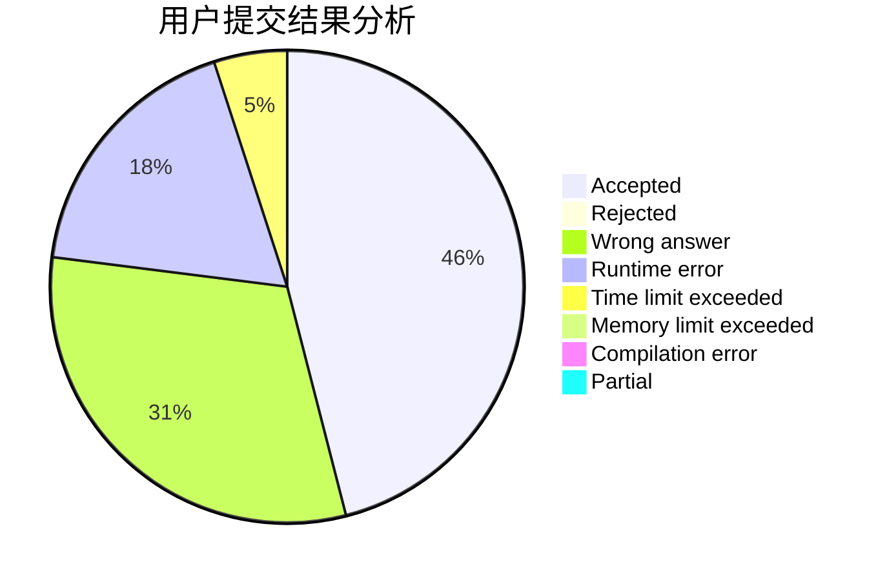
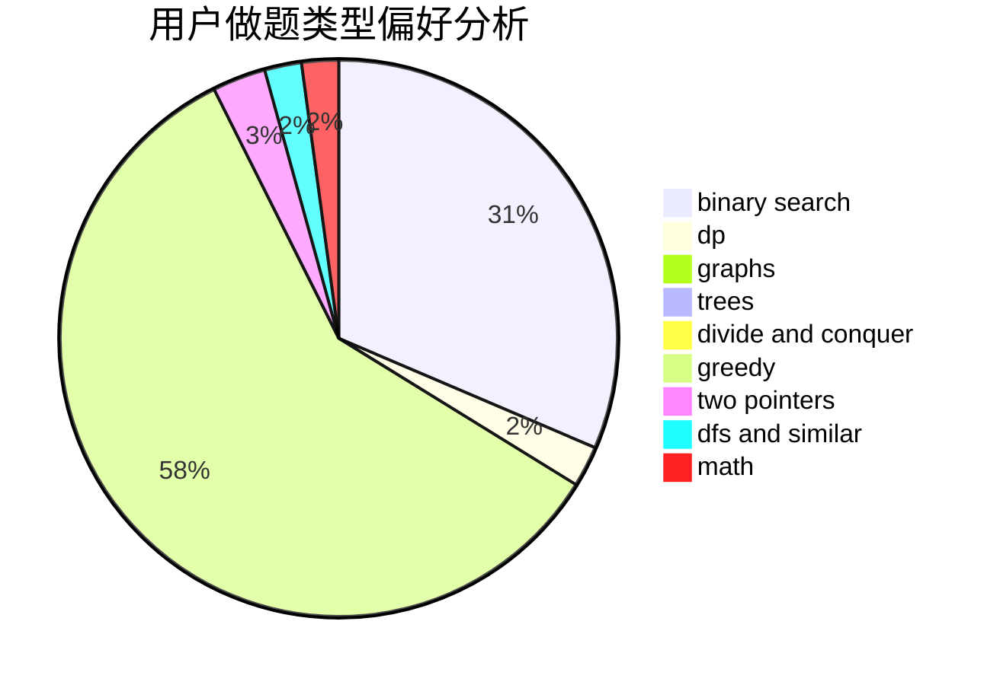

# zj713300

<!-- tabs:start -->

#### **用户提交结果分析**

#### **用户做题类型偏好分析**

<!-- tabs:end -->
# 推荐题目
[174B](https://codeforces.com/contest/174/problem/B)
[771E](https://codeforces.com/contest/771/problem/E)
[1325B](https://codeforces.com/contest/1325/problem/B)
[835A](https://codeforces.com/contest/835/problem/A)
[447E](https://codeforces.com/contest/447/problem/E)
[1205A](https://codeforces.com/contest/1205/problem/A)
[1054F](https://codeforces.com/contest/1054/problem/F)
[1096E](https://codeforces.com/contest/1096/problem/E)
[11892](https://codeforces.com/contest/1189/problem/2)
[1190C](https://codeforces.com/contest/1190/problem/C)
