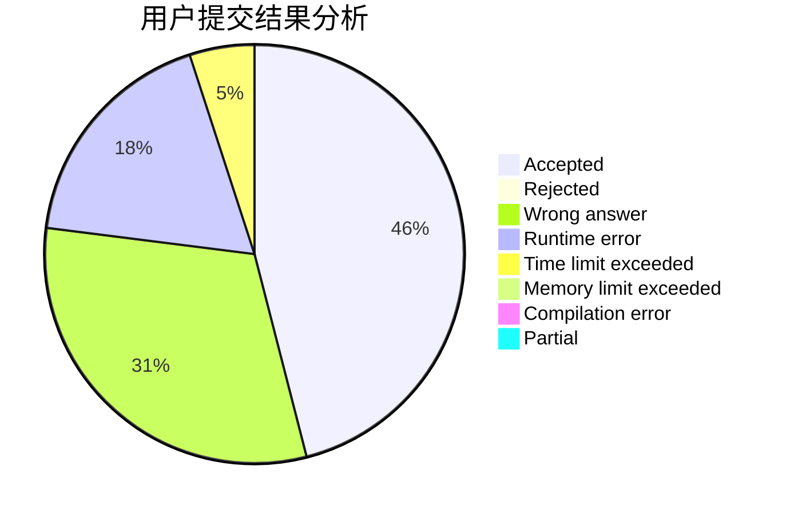
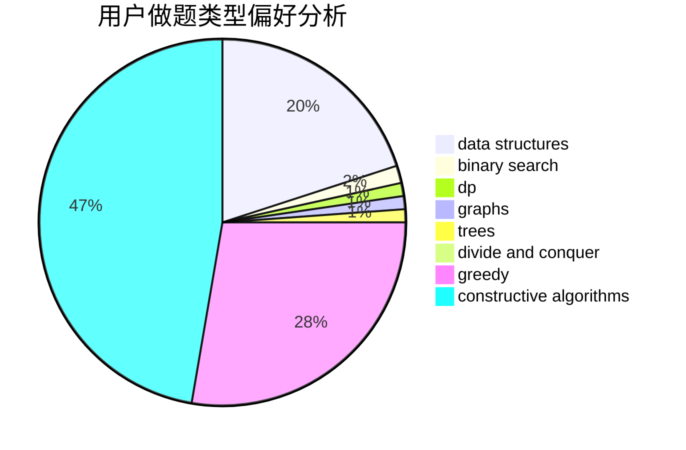
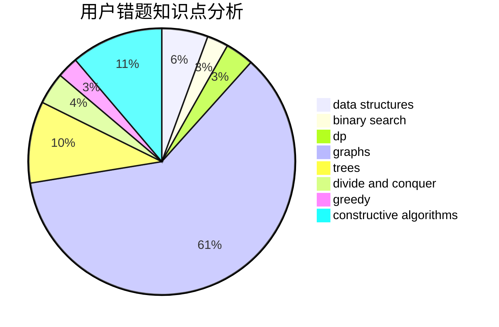

# zj713300

<!-- tabs:start -->

#### **用户提交结果分析**

#### **用户做题类型偏好分析**

#### **用户错题知识点分析**

<!-- tabs:end -->
# 推荐题目
[174B](https://codeforces.com/contest/174/problem/B)		dp,
                        greedy,
                        implementation		  
[771E](https://codeforces.com/contest/771/problem/E)		dp,
                        greedy		  
[1325B](https://codeforces.com/contest/1325/problem/B)		greedy,
                        implementation		  
[835A](https://codeforces.com/contest/835/problem/A)		math		  
[447E](https://codeforces.com/contest/447/problem/E)		dsu,graphs,sortings,trees		  
[1205A](https://codeforces.com/contest/1205/problem/A)		constructive algorithms,
                        greedy,
                        math		  
[1054F](https://codeforces.com/contest/1054/problem/F)		flows,
                        graph matchings		  
[1096E](https://codeforces.com/contest/1096/problem/E)		combinatorics,
                        dp,
                        math,
                        probabilities		  
[11892](https://codeforces.com/contest/1189/problem/2)		dsu,graphs,sortings,trees		  
[1190C](https://codeforces.com/contest/1190/problem/C)		brute force,
                        games,
                        greedy		  
