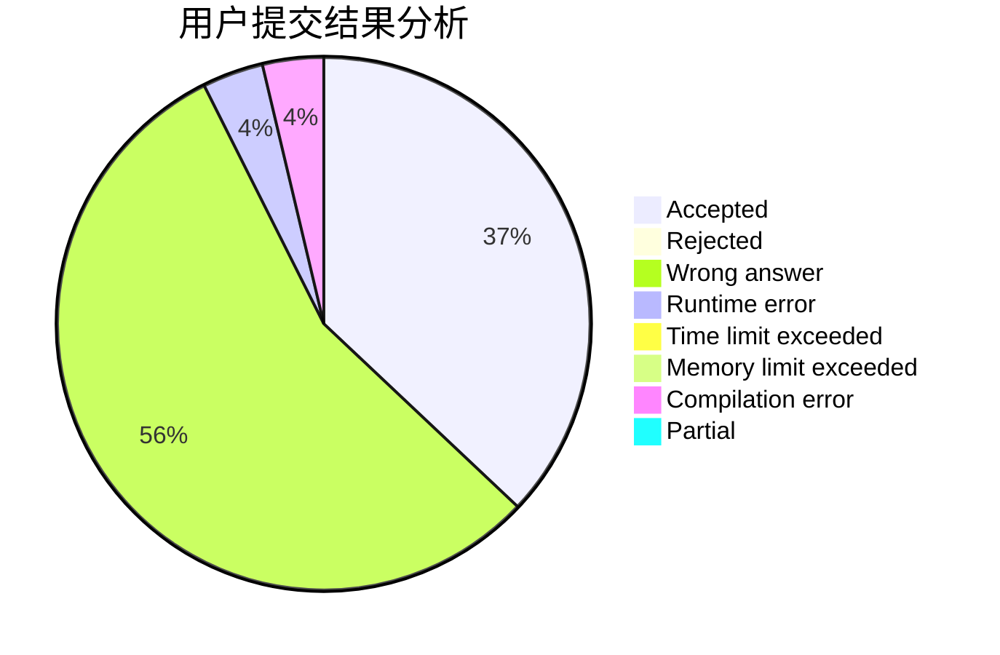
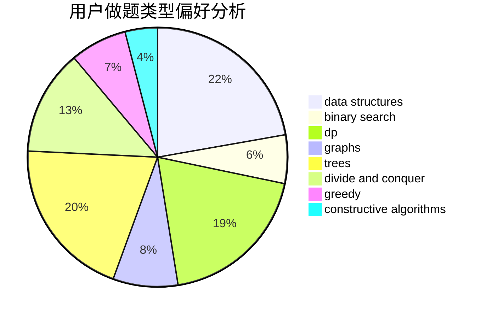
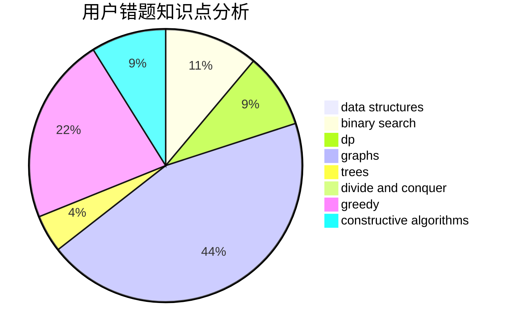

# zjBrave_shadow

<!-- tabs:start -->

#### **用户提交结果分析**

#### **用户做题类型偏好分析**

#### **用户错题知识点分析**

<!-- tabs:end -->
# 推荐题目
[607E](https://codeforces.com/contest/607/problem/E)		binary search,
                        geometry		  
[283B](https://codeforces.com/contest/283/problem/B)		dfs and similar,
                        dp,
                        graphs		  
[417E](https://codeforces.com/contest/417/problem/E)		constructive algorithms,
                        math,
                        probabilities		  
[854C](https://codeforces.com/contest/854/problem/C)		dsu,graphs,sortings,trees		  
[1340E](https://codeforces.com/contest/1340/problem/E)		graphs,
                        interactive,
                        probabilities		  
[822E](https://codeforces.com/contest/822/problem/E)		binary search,
                        dp,
                        hashing,
                        string suffix structures		  
[25B](https://codeforces.com/contest/25/problem/B)		implementation		  
[1286D](https://codeforces.com/contest/1286/problem/D)		data structures,
                        math,
                        matrices,
                        probabilities		  
[977B](https://codeforces.com/contest/977/problem/B)		implementation,
                        strings		  
[1432A](https://codeforces.com/contest/1432/problem/A)		dsu,graphs,sortings,trees		  
