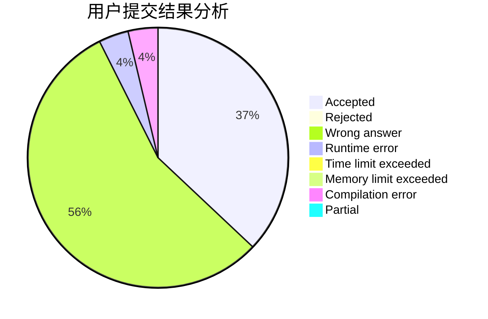
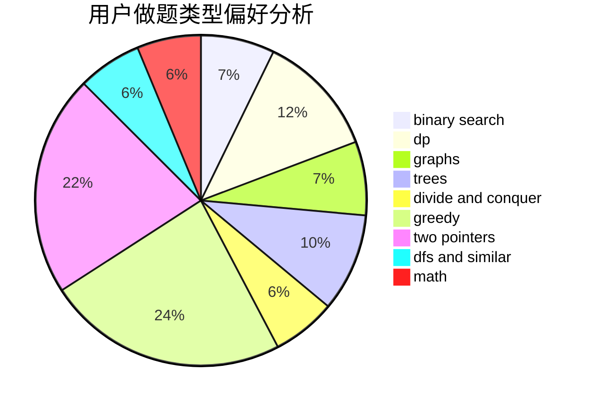

# zjBrave_shadow

<!-- tabs:start -->

#### **用户提交结果分析**

#### **用户做题类型偏好分析**

<!-- tabs:end -->
# 推荐题目
[607E](https://codeforces.com/contest/607/problem/E)
[283B](https://codeforces.com/contest/283/problem/B)
[417E](https://codeforces.com/contest/417/problem/E)
[854C](https://codeforces.com/contest/854/problem/C)
[1340E](https://codeforces.com/contest/1340/problem/E)
[822E](https://codeforces.com/contest/822/problem/E)
[25B](https://codeforces.com/contest/25/problem/B)
[1286D](https://codeforces.com/contest/1286/problem/D)
[977B](https://codeforces.com/contest/977/problem/B)
[1432A](https://codeforces.com/contest/1432/problem/A)
