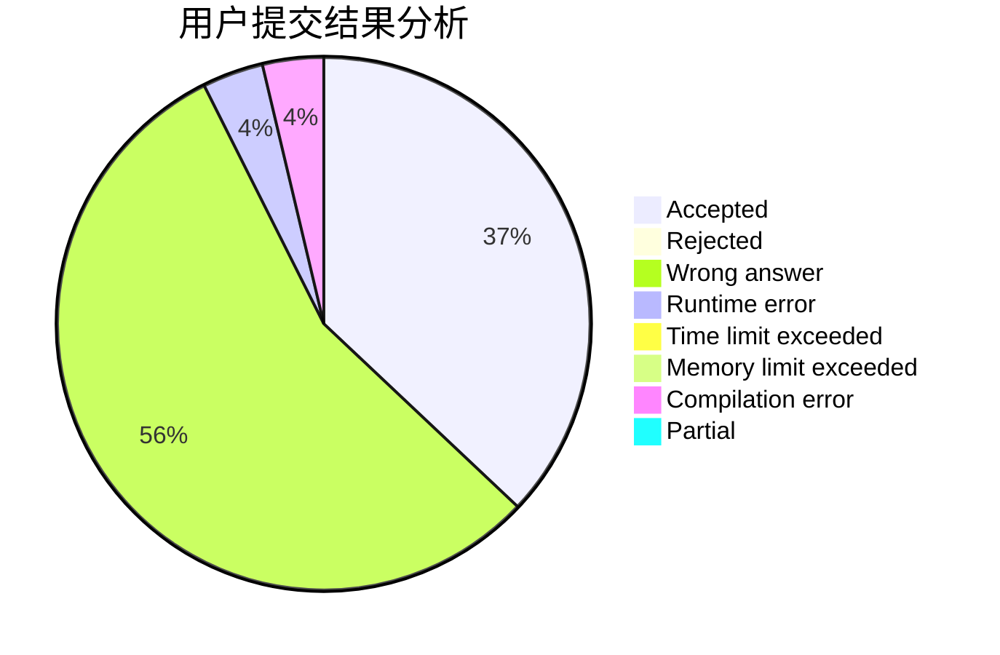
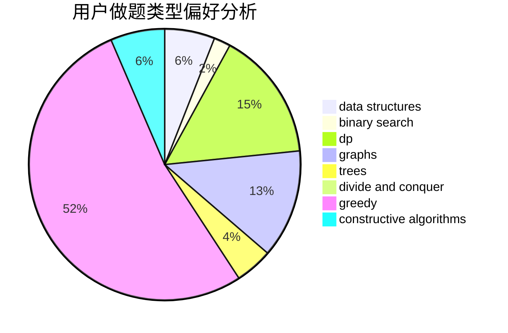
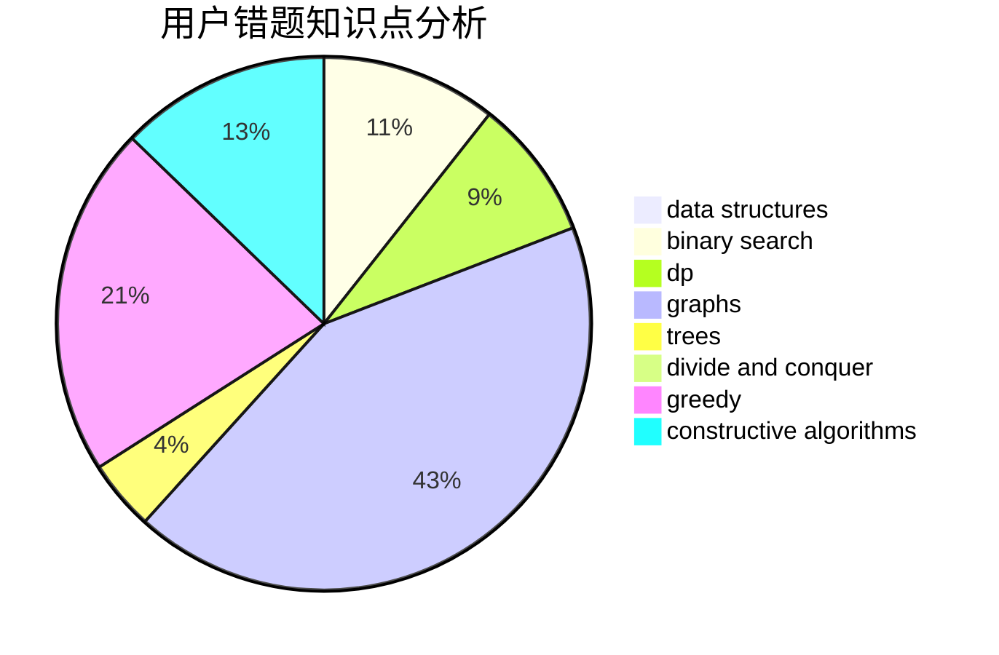

# zjBrave_shadow

<!-- tabs:start -->

#### **用户提交结果分析**

#### **用户做题类型偏好分析**

#### **用户错题知识点分析**

<!-- tabs:end -->
# 推荐题目
[587D](https://codeforces.com/contest/587/problem/D)		2-sat,
                        binary search		  
[268A](https://codeforces.com/contest/268/problem/A)		brute force		  
[388C](https://codeforces.com/contest/388/problem/C)		games,
                        greedy,
                        sortings		  
[837C](https://codeforces.com/contest/837/problem/C)		brute force,
                        implementation		  
[1333F](https://codeforces.com/contest/1333/problem/F)		greedy,
                        implementation,
                        math,
                        number theory,
                        sortings,
                        two pointers		  
[807E](https://codeforces.com/contest/807/problem/E)		dsu,graphs,sortings,trees		  
[237A](https://codeforces.com/contest/237/problem/A)		implementation		  
[1280C](https://codeforces.com/contest/1280/problem/C)		dfs and similar,
                        graphs,
                        greedy,
                        trees		  
[955B](https://codeforces.com/contest/955/problem/B)		implementation		  
[1423K](https://codeforces.com/contest/1423/problem/K)		binary search,
                        math,
                        number theory,
                        two pointers		  
