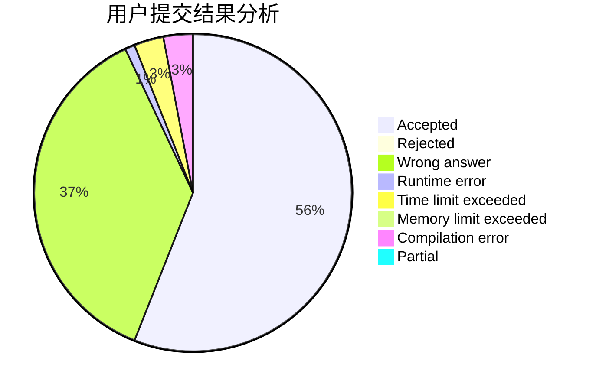
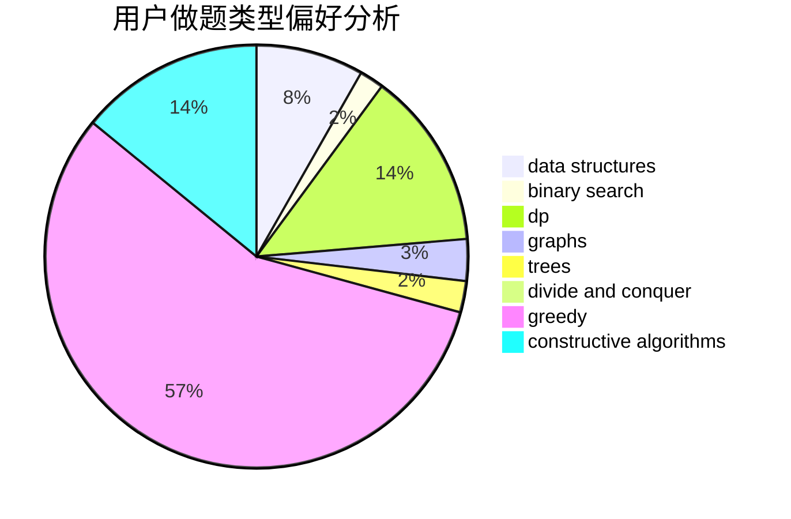

# zja601

<!-- tabs:start -->

#### **用户提交结果分析**

#### **用户做题类型偏好分析**

#### **用户错题知识点分析**

<!-- tabs:end -->
# 推荐题目
[1101C](https://codeforces.com/contest/1101/problem/C)		sortings		  
[185A](https://codeforces.com/contest/185/problem/A)		math		  
[281A](https://codeforces.com/contest/281/problem/A)		implementation,
                        strings		  
[433B](https://codeforces.com/contest/433/problem/B)		dp,
                        implementation,
                        sortings		  
[139A](https://codeforces.com/contest/139/problem/A)		implementation		  
[1213F](https://codeforces.com/contest/1213/problem/F)		data structures,
                        dfs and similar,
                        dsu,
                        graphs,
                        greedy,
                        implementation,
                        strings		  
[949E](https://codeforces.com/contest/949/problem/E)		brute force		  
[544C](https://codeforces.com/contest/544/problem/C)		dsu,graphs,sortings,trees		  
[639B](https://codeforces.com/contest/639/problem/B)		constructive algorithms,
                        graphs,
                        trees		  
[508A](https://codeforces.com/contest/508/problem/A)		brute force		  
