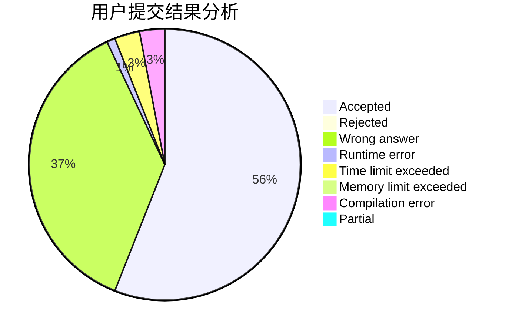
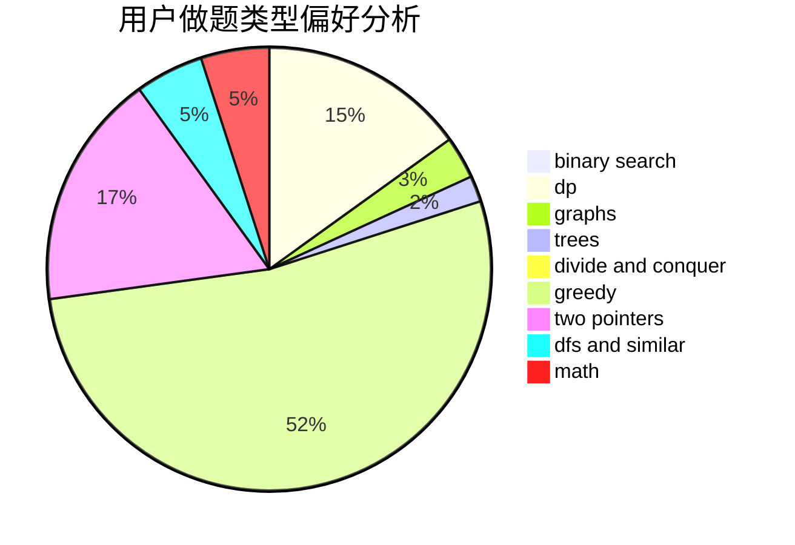

# zja601

<!-- tabs:start -->

#### **用户提交结果分析**

#### **用户做题类型偏好分析**

<!-- tabs:end -->
# 推荐题目
[1101C](https://codeforces.com/contest/1101/problem/C)
[185A](https://codeforces.com/contest/185/problem/A)
[281A](https://codeforces.com/contest/281/problem/A)
[433B](https://codeforces.com/contest/433/problem/B)
[139A](https://codeforces.com/contest/139/problem/A)
[1213F](https://codeforces.com/contest/1213/problem/F)
[949E](https://codeforces.com/contest/949/problem/E)
[544C](https://codeforces.com/contest/544/problem/C)
[639B](https://codeforces.com/contest/639/problem/B)
[508A](https://codeforces.com/contest/508/problem/A)
