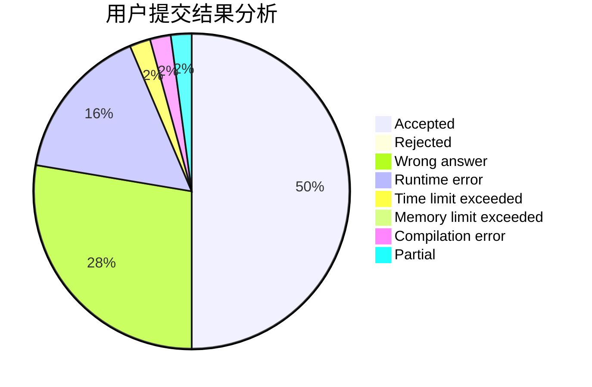
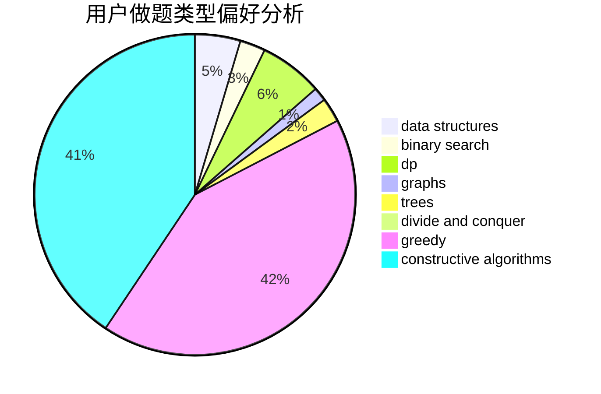
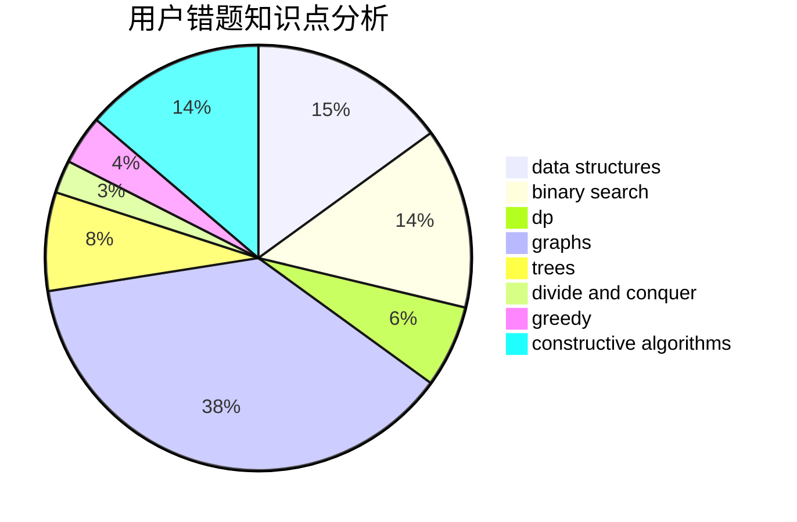

# zjczzzjczjczzzjc

<!-- tabs:start -->

#### **用户提交结果分析**

#### **用户做题类型偏好分析**

#### **用户错题知识点分析**

<!-- tabs:end -->
# 推荐题目
[1484E](https://codeforces.com/contest/1484/problem/E)		dsu,graphs,sortings,trees		  
[1168E](https://codeforces.com/contest/1168/problem/E)		constructive algorithms,
                        math		  
[20C](https://codeforces.com/contest/20/problem/C)		graphs,
                        shortest paths		  
[269C](https://codeforces.com/contest/269/problem/C)		constructive algorithms,
                        flows,
                        graphs,
                        greedy		  
[847E](https://codeforces.com/contest/847/problem/E)		binary search,
                        dp		  
[629E](https://codeforces.com/contest/629/problem/E)		combinatorics,
                        data structures,
                        dfs and similar,
                        dp,
                        probabilities,
                        trees		  
[1346A](https://codeforces.com/contest/1346/problem/A)		*special problem,
                        math		  
[1461F](https://codeforces.com/contest/1461/problem/F)		constructive algorithms,
                        dp,
                        greedy		  
[828A](https://codeforces.com/contest/828/problem/A)		implementation		  
[621B](https://codeforces.com/contest/621/problem/B)		combinatorics,
                        implementation		  
