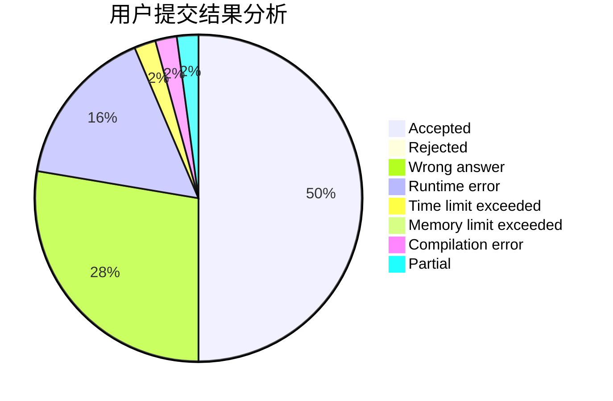
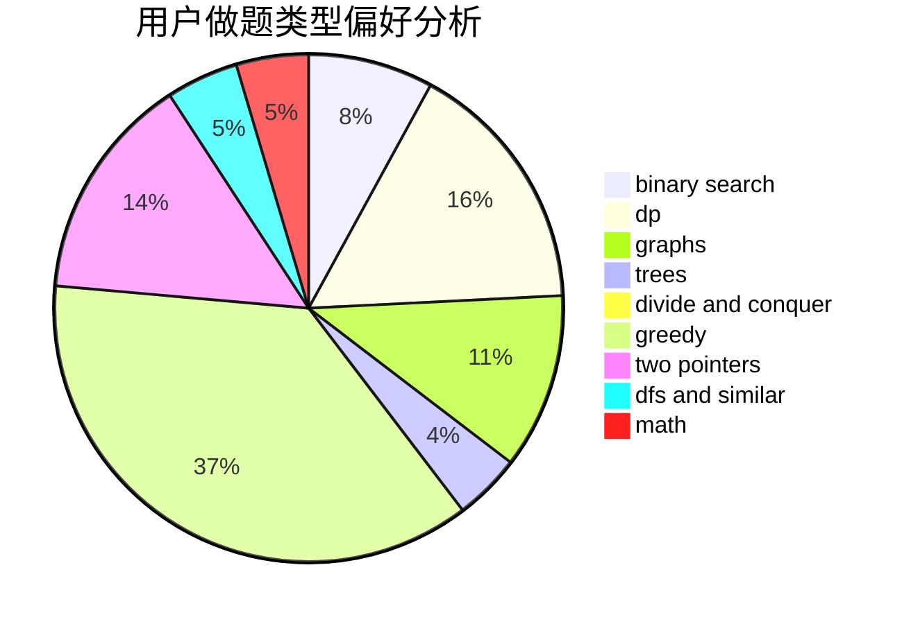

# zjczzzjczjczzzjc

<!-- tabs:start -->

#### **用户提交结果分析**

#### **用户做题类型偏好分析**

<!-- tabs:end -->
# 推荐题目
[1484E](https://codeforces.com/contest/1484/problem/E)
[1168E](https://codeforces.com/contest/1168/problem/E)
[20C](https://codeforces.com/contest/20/problem/C)
[269C](https://codeforces.com/contest/269/problem/C)
[847E](https://codeforces.com/contest/847/problem/E)
[629E](https://codeforces.com/contest/629/problem/E)
[1346A](https://codeforces.com/contest/1346/problem/A)
[1461F](https://codeforces.com/contest/1461/problem/F)
[828A](https://codeforces.com/contest/828/problem/A)
[621B](https://codeforces.com/contest/621/problem/B)
