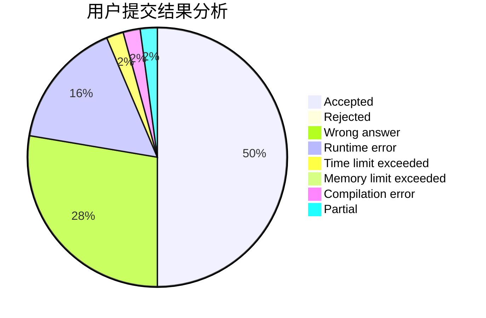
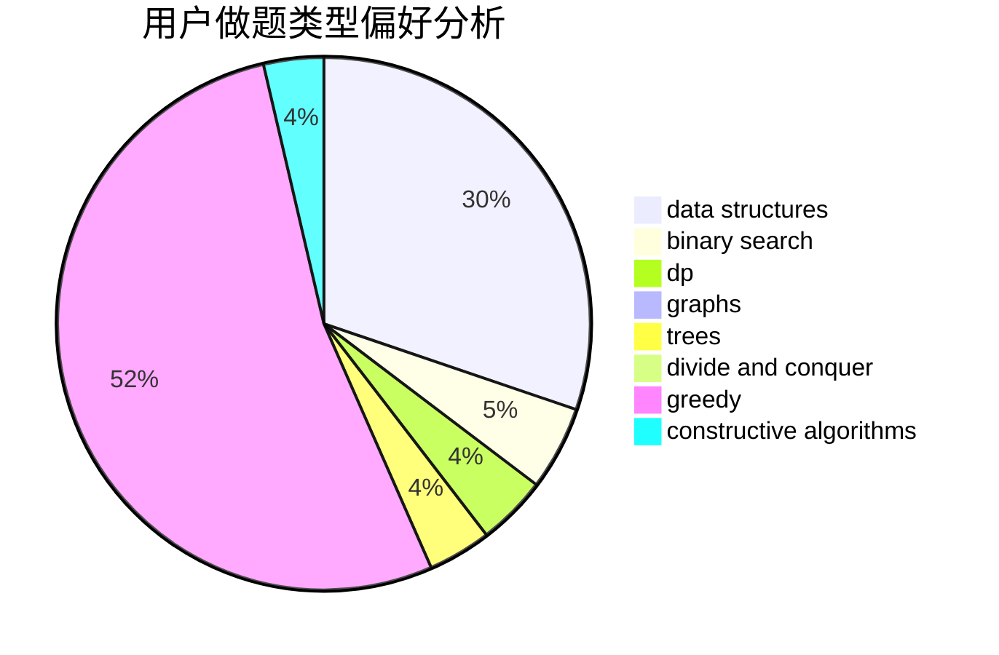
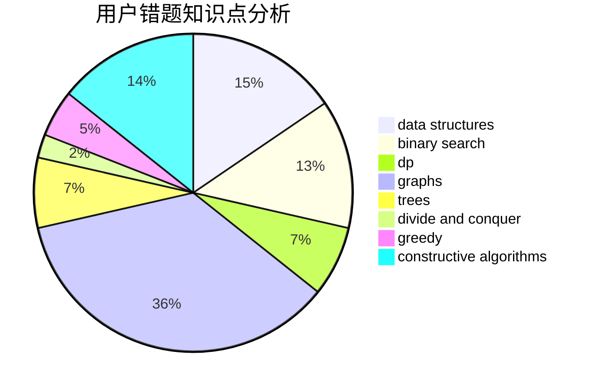

# zjczzzjczjczzzjc

<!-- tabs:start -->

#### **用户提交结果分析**

#### **用户做题类型偏好分析**

#### **用户错题知识点分析**

<!-- tabs:end -->
# 推荐题目
[1476A](https://codeforces.com/contest/1476/problem/A)		binary search,
                        constructive algorithms,
                        greedy,
                        math		  
[1166A](https://codeforces.com/contest/1166/problem/A)		combinatorics,
                        greedy		  
[185E](https://codeforces.com/contest/185/problem/E)		binary search,
                        data structures		  
[251A](https://codeforces.com/contest/251/problem/A)		binary search,
                        combinatorics,
                        two pointers		  
[828E](https://codeforces.com/contest/828/problem/E)		dsu,graphs,sortings,trees		  
[610C](https://codeforces.com/contest/610/problem/C)		constructive algorithms		  
[1339A](https://codeforces.com/contest/1339/problem/A)		brute force,
                        dp,
                        implementation,
                        math		  
[1452C](https://codeforces.com/contest/1452/problem/C)		greedy		  
[810A](https://codeforces.com/contest/810/problem/A)		implementation,
                        math		  
[602A](https://codeforces.com/contest/602/problem/A)		brute force,
                        implementation		  
