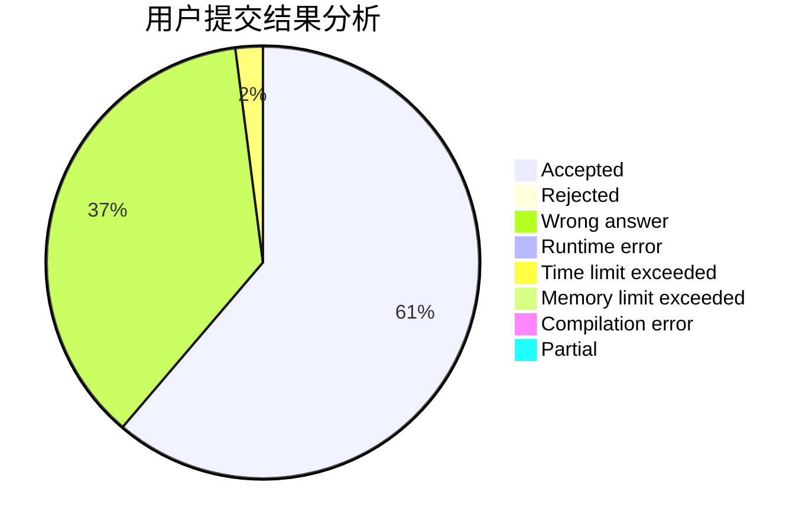
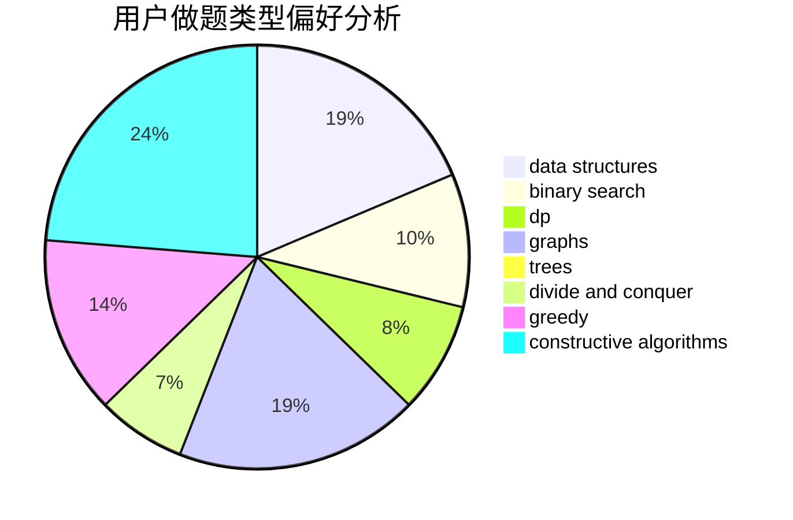
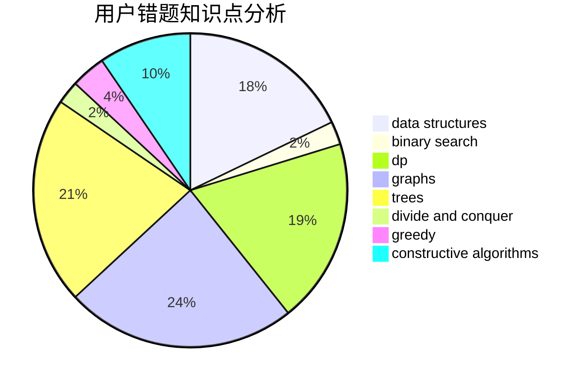

# zjdmz

<!-- tabs:start -->

#### **用户提交结果分析**

#### **用户做题类型偏好分析**

#### **用户错题知识点分析**

<!-- tabs:end -->
# 推荐题目
[1421E](https://codeforces.com/contest/1421/problem/E)		brute force,
                        dp,
                        implementation		  
[485A](https://codeforces.com/contest/485/problem/A)		implementation,
                        math,
                        matrices		  
[47B](https://codeforces.com/contest/47/problem/B)		implementation		  
[13561](https://codeforces.com/contest/1356/problem/1)		dsu,graphs,sortings,trees		  
[1129B](https://codeforces.com/contest/1129/problem/B)		constructive algorithms		  
[1025F](https://codeforces.com/contest/1025/problem/F)		geometry		  
[180D](https://codeforces.com/contest/180/problem/D)		greedy,
                        strings		  
[360B](https://codeforces.com/contest/360/problem/B)		binary search,
                        dp		  
[584D](https://codeforces.com/contest/584/problem/D)		brute force,
                        math,
                        number theory		  
[1490C](https://codeforces.com/contest/1490/problem/C)		binary search,
                        brute force,
                        brute force,
                        math		  
