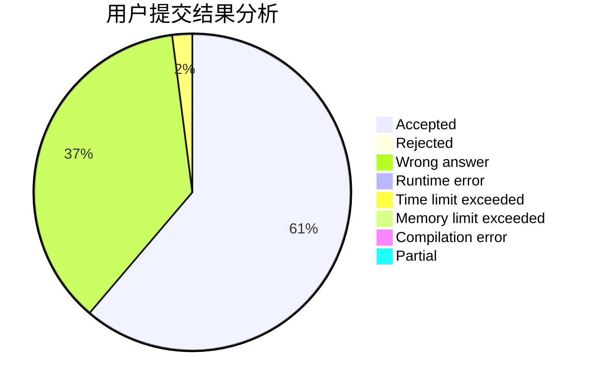
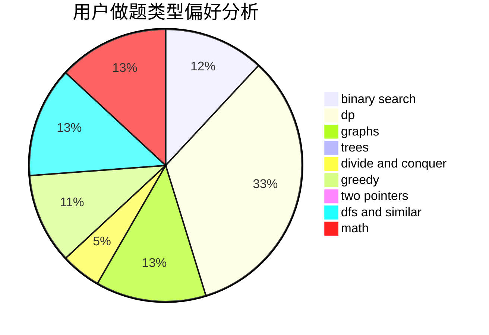

# zjdmz

<!-- tabs:start -->

#### **用户提交结果分析**

#### **用户做题类型偏好分析**

<!-- tabs:end -->
# 推荐题目
[1421E](https://codeforces.com/contest/1421/problem/E)
[485A](https://codeforces.com/contest/485/problem/A)
[47B](https://codeforces.com/contest/47/problem/B)
[13561](https://codeforces.com/contest/1356/problem/1)
[1129B](https://codeforces.com/contest/1129/problem/B)
[1025F](https://codeforces.com/contest/1025/problem/F)
[180D](https://codeforces.com/contest/180/problem/D)
[360B](https://codeforces.com/contest/360/problem/B)
[584D](https://codeforces.com/contest/584/problem/D)
[1490C](https://codeforces.com/contest/1490/problem/C)
