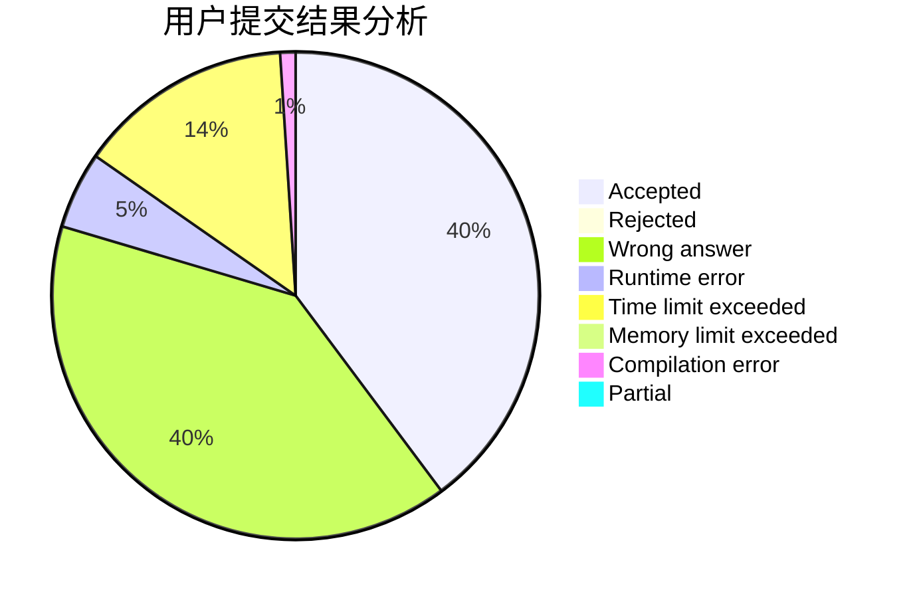
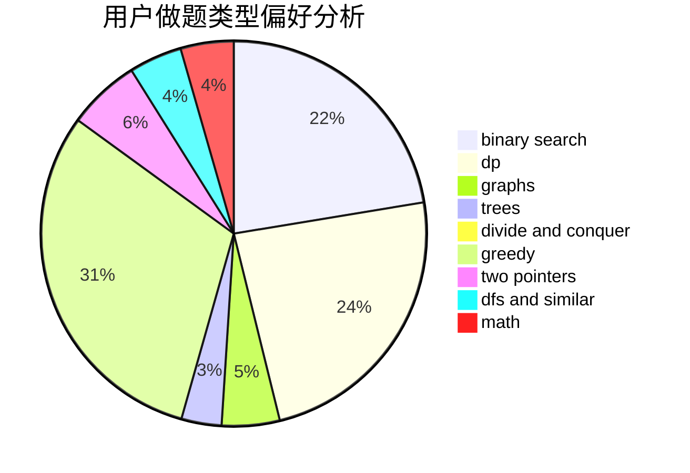

# zjhl2

<!-- tabs:start -->

#### **用户提交结果分析**

#### **用户做题类型偏好分析**

<!-- tabs:end -->
# 推荐题目
[1151C](https://codeforces.com/contest/1151/problem/C)
[1263C](https://codeforces.com/contest/1263/problem/C)
[1118B](https://codeforces.com/contest/1118/problem/B)
[343B](https://codeforces.com/contest/343/problem/B)
[78C](https://codeforces.com/contest/78/problem/C)
[656F](https://codeforces.com/contest/656/problem/F)
[1382B](https://codeforces.com/contest/1382/problem/B)
[932A](https://codeforces.com/contest/932/problem/A)
[922D](https://codeforces.com/contest/922/problem/D)
[1471D](https://codeforces.com/contest/1471/problem/D)
