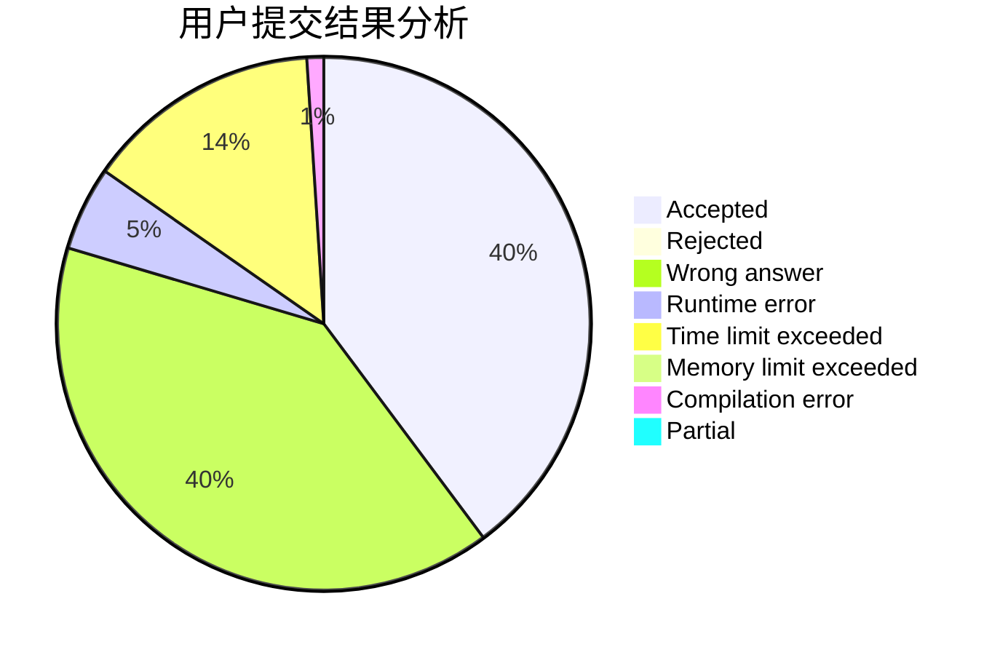
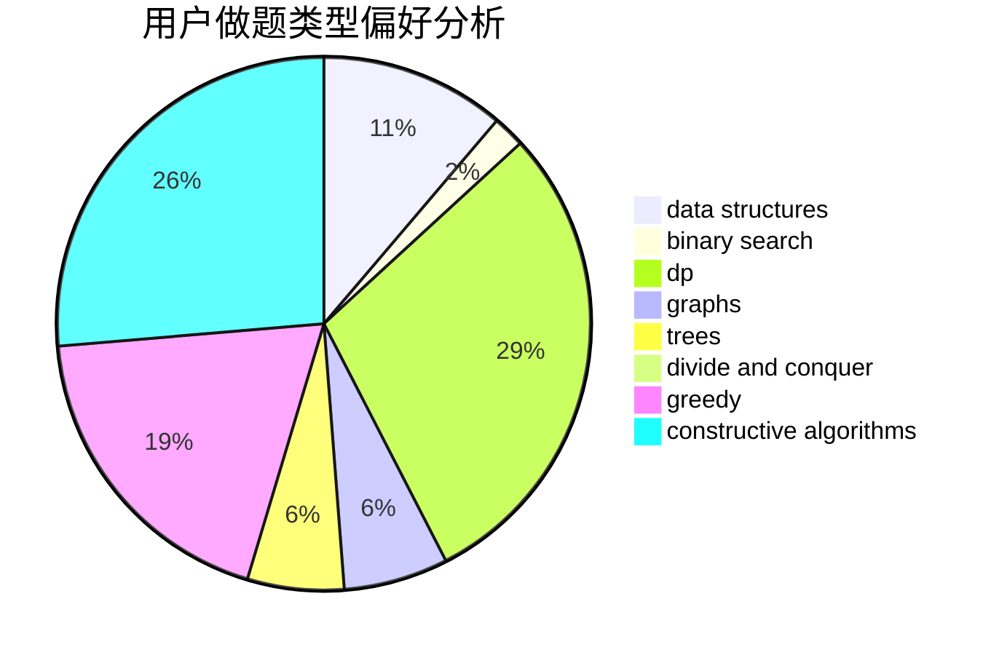
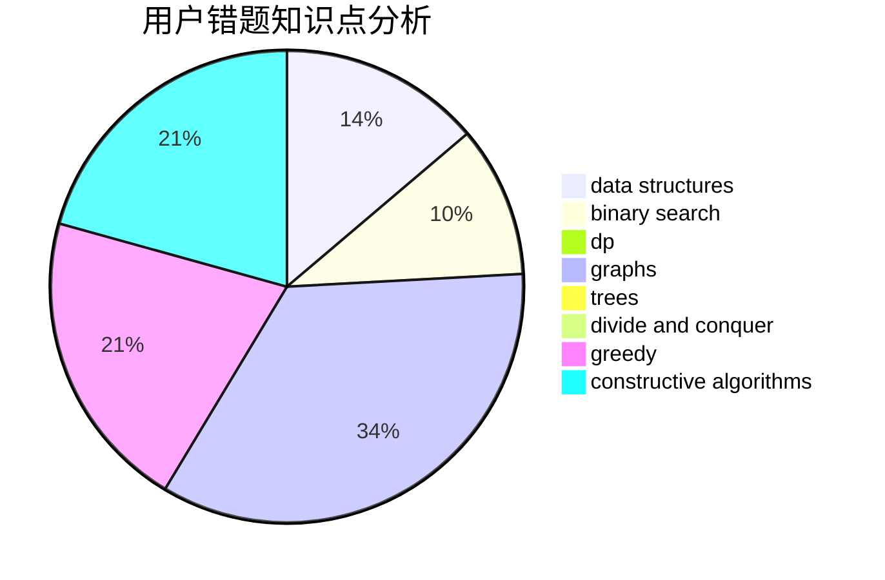

# zjhl2

<!-- tabs:start -->

#### **用户提交结果分析**

#### **用户做题类型偏好分析**

#### **用户错题知识点分析**

<!-- tabs:end -->
# 推荐题目
[1151C](https://codeforces.com/contest/1151/problem/C)		constructive algorithms,
                        math		  
[1263C](https://codeforces.com/contest/1263/problem/C)		binary search,
                        math,
                        meet-in-the-middle,
                        number theory		  
[1118B](https://codeforces.com/contest/1118/problem/B)		implementation		  
[343B](https://codeforces.com/contest/343/problem/B)		data structures,
                        greedy,
                        implementation		  
[78C](https://codeforces.com/contest/78/problem/C)		dp,
                        games,
                        number theory		  
[656F](https://codeforces.com/contest/656/problem/F)		*special problem		  
[1382B](https://codeforces.com/contest/1382/problem/B)		dp,
                        games		  
[932A](https://codeforces.com/contest/932/problem/A)		constructive algorithms		  
[922D](https://codeforces.com/contest/922/problem/D)		greedy,
                        sortings		  
[1471D](https://codeforces.com/contest/1471/problem/D)		dsu,graphs,sortings,trees		  
