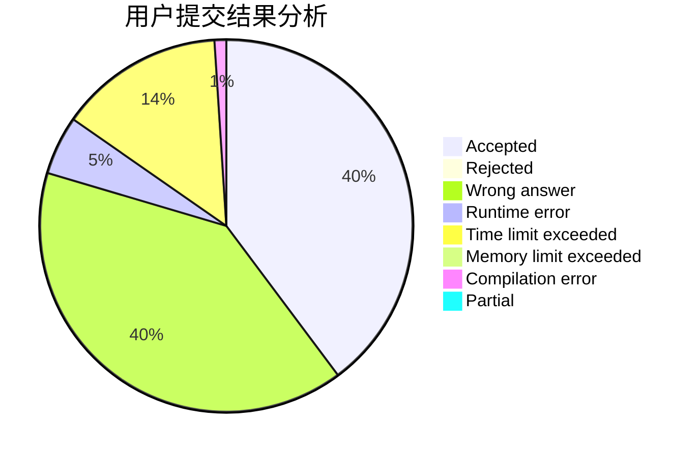
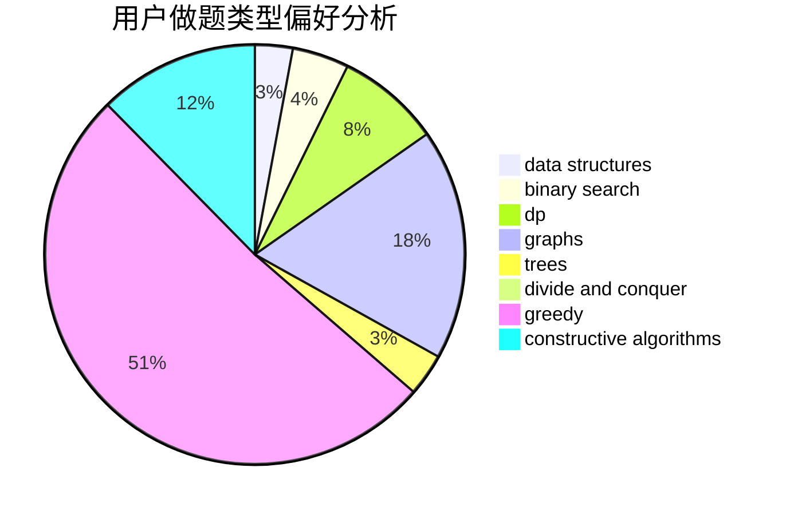
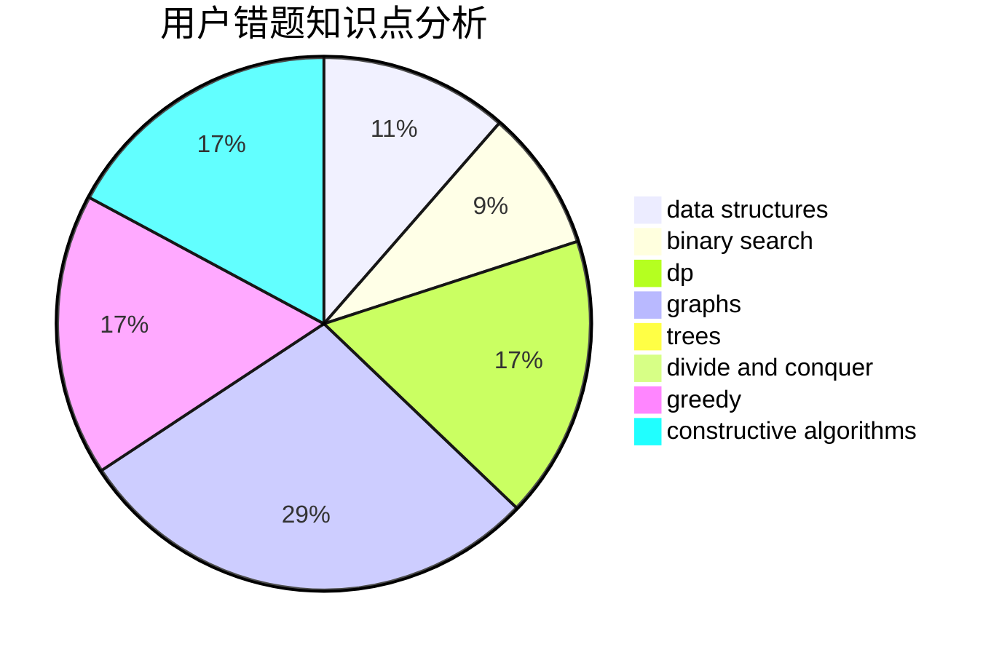

# zjhl2

<!-- tabs:start -->

#### **用户提交结果分析**

#### **用户做题类型偏好分析**

#### **用户错题知识点分析**

<!-- tabs:end -->
# 推荐题目
[1149E](https://codeforces.com/contest/1149/problem/E)		games,
                        graphs		  
[1256A](https://codeforces.com/contest/1256/problem/A)		math		  
[1116D2](https://codeforces.com/contest/1116D/problem/2)		nan		  
[316E3](https://codeforces.com/contest/316E/problem/3)		data structures,
                        math		  
[76D](https://codeforces.com/contest/76/problem/D)		dp,
                        greedy,
                        math		  
[628F](https://codeforces.com/contest/628/problem/F)		flows		  
[1373F](https://codeforces.com/contest/1373/problem/F)		binary search,
                        constructive algorithms,
                        data structures,
                        greedy		  
[913C](https://codeforces.com/contest/913/problem/C)		bitmasks,
                        dp,
                        greedy		  
[908C](https://codeforces.com/contest/908/problem/C)		brute force,
                        geometry,
                        implementation,
                        math		  
[1464C](https://codeforces.com/contest/1464/problem/C)		dsu,graphs,sortings,trees		  
