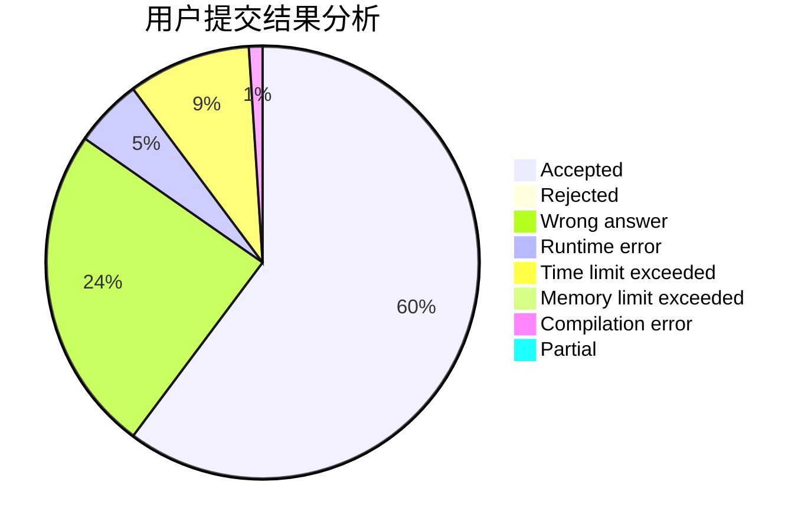
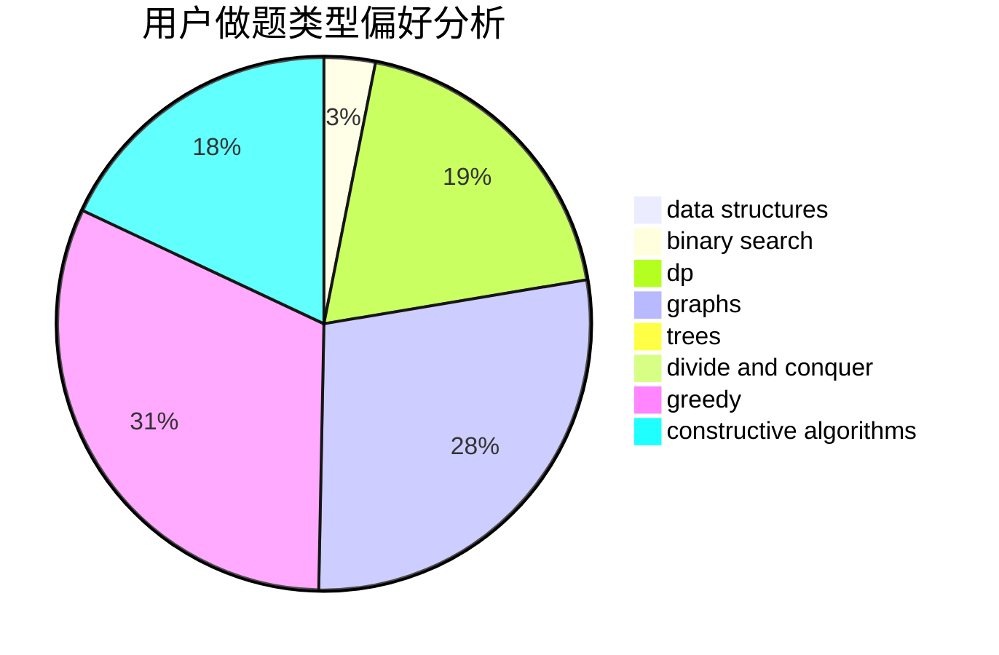
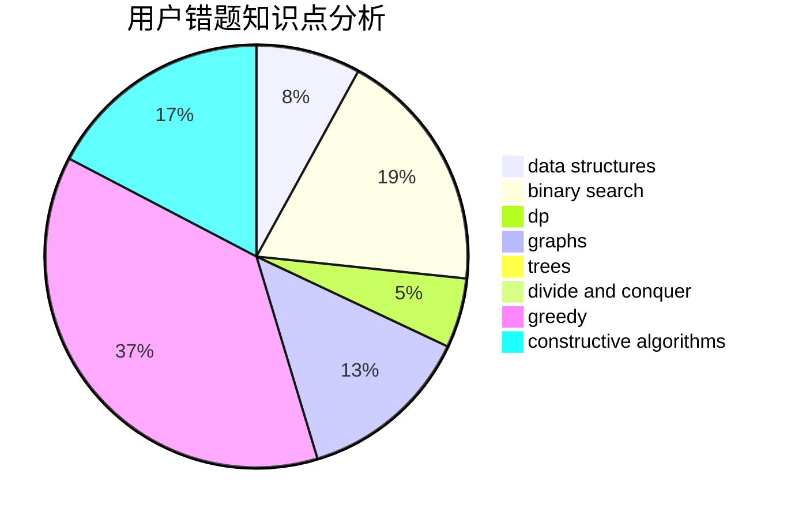

# zjjcth330

<!-- tabs:start -->

#### **用户提交结果分析**

#### **用户做题类型偏好分析**

#### **用户错题知识点分析**

<!-- tabs:end -->
# 推荐题目
[1263D](https://codeforces.com/contest/1263/problem/D)		dfs and similar,
                        dsu,
                        graphs		  
[1378A2](https://codeforces.com/contest/1378A/problem/2)		dsu,graphs,sortings,trees		  
[700C](https://codeforces.com/contest/700/problem/C)		dfs and similar,
                        graphs		  
[707E](https://codeforces.com/contest/707/problem/E)		data structures		  
[1102A](https://codeforces.com/contest/1102/problem/A)		math		  
[438A](https://codeforces.com/contest/438/problem/A)		dsu,graphs,sortings,trees		  
[1459B](https://codeforces.com/contest/1459/problem/B)		dp,
                        math		  
[896A](https://codeforces.com/contest/896/problem/A)		binary search,
                        dfs and similar		  
[338E](https://codeforces.com/contest/338/problem/E)		data structures		  
[1072D](https://codeforces.com/contest/1072/problem/D)		dsu,graphs,sortings,trees		  
