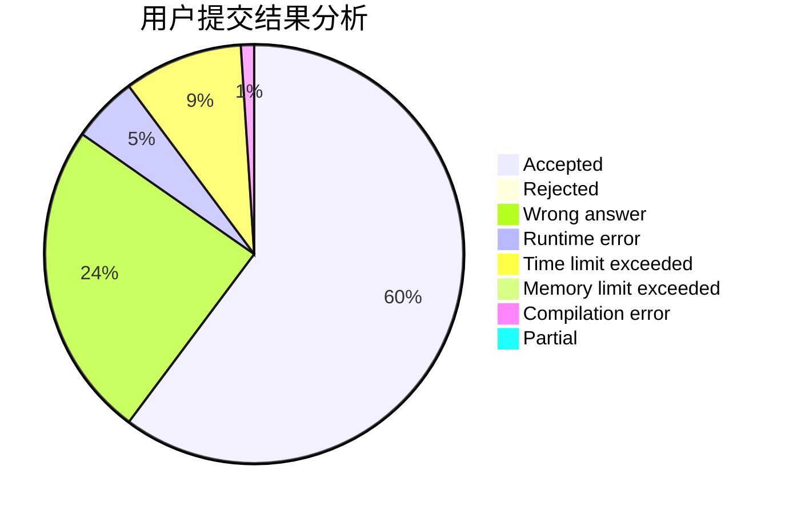
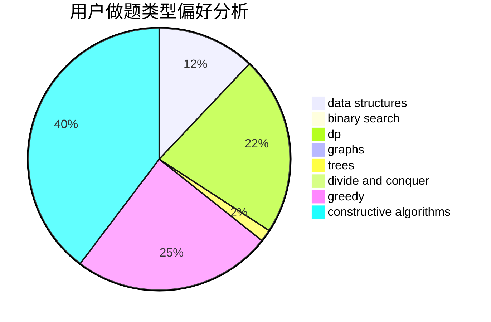
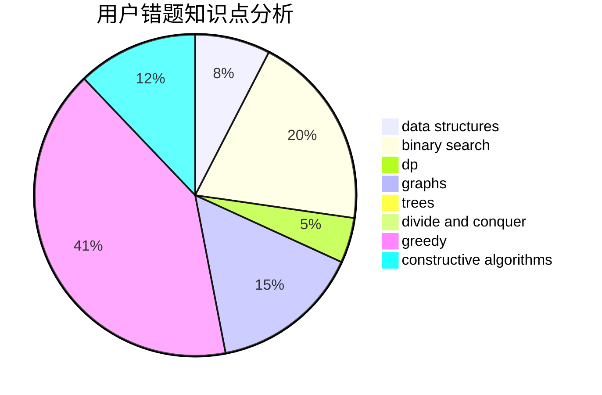

# zjjcth330

<!-- tabs:start -->

#### **用户提交结果分析**

#### **用户做题类型偏好分析**

#### **用户错题知识点分析**

<!-- tabs:end -->
# 推荐题目
[1269B](https://codeforces.com/contest/1269/problem/B)		brute force,
                        sortings		  
[1387A](https://codeforces.com/contest/1387/problem/A)		*special problem,
                        binary search,
                        dfs and similar,
                        dp,
                        math,
                        ternary search		  
[718D](https://codeforces.com/contest/718/problem/D)		dp,
                        hashing,
                        trees		  
[725G](https://codeforces.com/contest/725/problem/G)		nan		  
[1102D](https://codeforces.com/contest/1102/problem/D)		greedy,
                        strings		  
[45D](https://codeforces.com/contest/45/problem/D)		greedy,
                        meet-in-the-middle,
                        sortings		  
[1468B](https://codeforces.com/contest/1468/problem/B)		data structures,
                        dsu		  
[913D](https://codeforces.com/contest/913/problem/D)		binary search,
                        brute force,
                        data structures,
                        greedy,
                        sortings		  
[364D](https://codeforces.com/contest/364/problem/D)		brute force,
                        math,
                        probabilities		  
[1073C](https://codeforces.com/contest/1073/problem/C)		binary search,
                        two pointers		  
