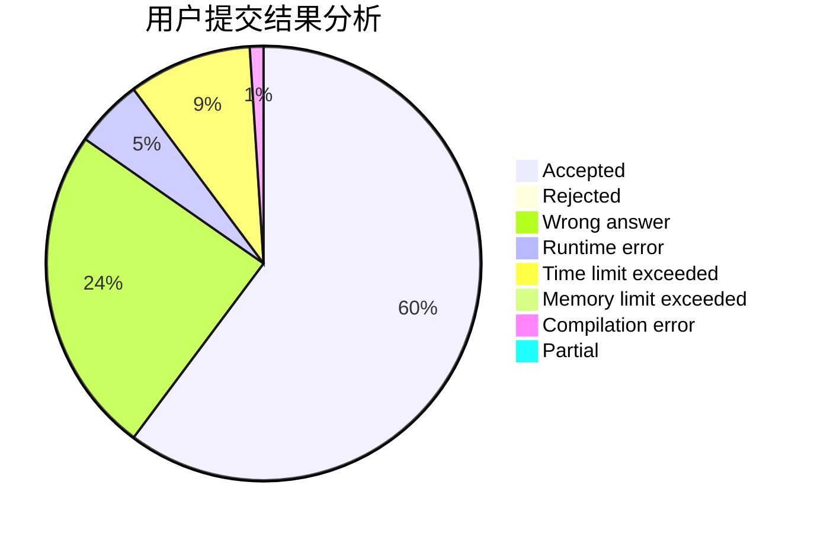
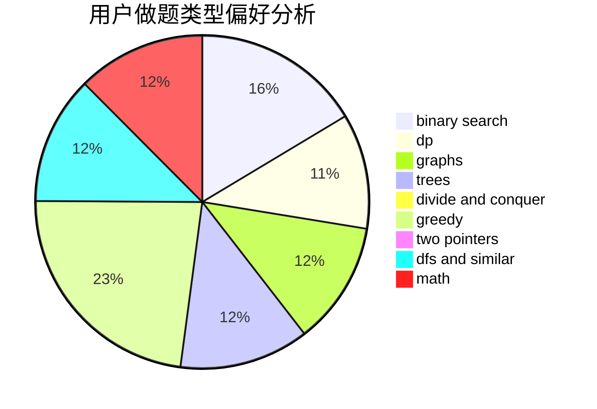

# zjjcth330

<!-- tabs:start -->

#### **用户提交结果分析**

#### **用户做题类型偏好分析**

<!-- tabs:end -->
# 推荐题目
[1269B](https://codeforces.com/contest/1269/problem/B)
[1387A](https://codeforces.com/contest/1387/problem/A)
[718D](https://codeforces.com/contest/718/problem/D)
[725G](https://codeforces.com/contest/725/problem/G)
[1102D](https://codeforces.com/contest/1102/problem/D)
[45D](https://codeforces.com/contest/45/problem/D)
[1468B](https://codeforces.com/contest/1468/problem/B)
[913D](https://codeforces.com/contest/913/problem/D)
[364D](https://codeforces.com/contest/364/problem/D)
[1073C](https://codeforces.com/contest/1073/problem/C)
