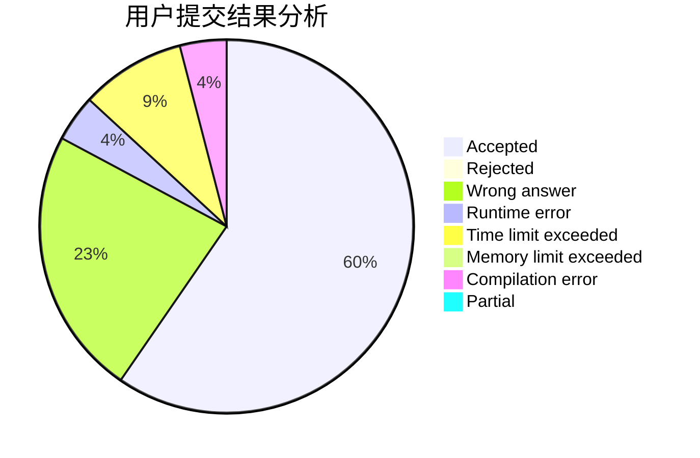
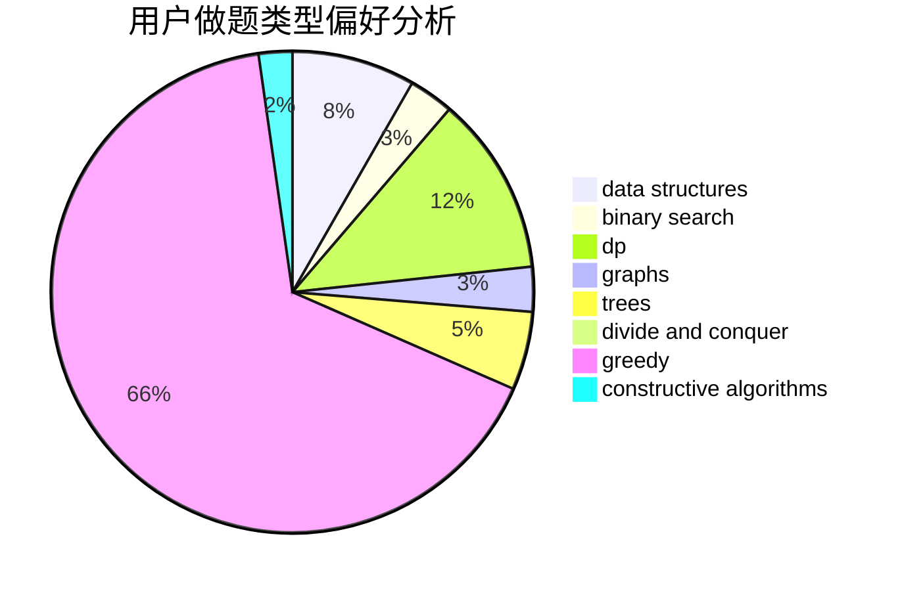
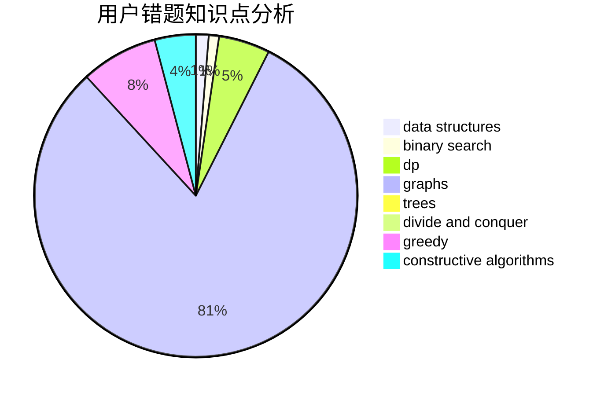

# zjjws

<!-- tabs:start -->

#### **用户提交结果分析**

#### **用户做题类型偏好分析**

#### **用户错题知识点分析**

<!-- tabs:end -->
# 推荐题目
[304B](https://codeforces.com/contest/304/problem/B)		brute force,
                        implementation		  
[1251B](https://codeforces.com/contest/1251/problem/B)		greedy,
                        strings		  
[22C](https://codeforces.com/contest/22/problem/C)		graphs		  
[1355A](https://codeforces.com/contest/1355/problem/A)		brute force,
                        implementation,
                        math		  
[803D](https://codeforces.com/contest/803/problem/D)		binary search,
                        greedy		  
[1303C](https://codeforces.com/contest/1303/problem/C)		dfs and similar,
                        greedy,
                        implementation		  
[309B](https://codeforces.com/contest/309/problem/B)		dp,
                        two pointers		  
[812B](https://codeforces.com/contest/812/problem/B)		bitmasks,
                        brute force,
                        dp		  
[526G](https://codeforces.com/contest/526/problem/G)		greedy,
                        trees		  
[496E](https://codeforces.com/contest/496/problem/E)		greedy,
                        sortings		  
