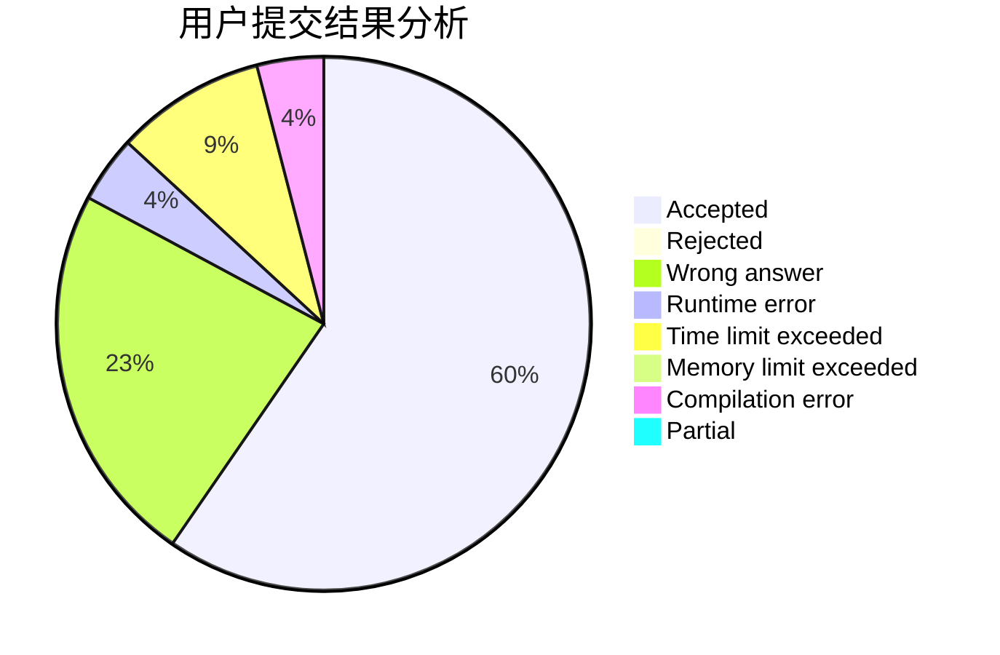
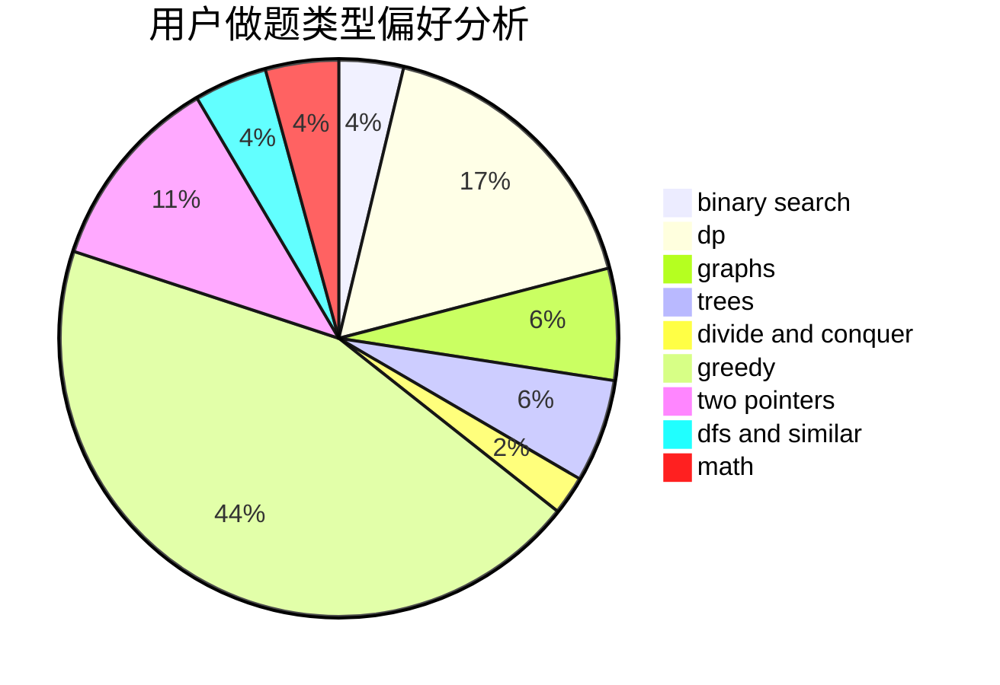

# zjjws

<!-- tabs:start -->

#### **用户提交结果分析**

#### **用户做题类型偏好分析**

<!-- tabs:end -->
# 推荐题目
[323C](https://codeforces.com/contest/323/problem/C)
[1256C](https://codeforces.com/contest/1256/problem/C)
[251A](https://codeforces.com/contest/251/problem/A)
[1361E](https://codeforces.com/contest/1361/problem/E)
[819B](https://codeforces.com/contest/819/problem/B)
[1312A](https://codeforces.com/contest/1312/problem/A)
[32A](https://codeforces.com/contest/32/problem/A)
[830E](https://codeforces.com/contest/830/problem/E)
[551A](https://codeforces.com/contest/551/problem/A)
[516A](https://codeforces.com/contest/516/problem/A)
