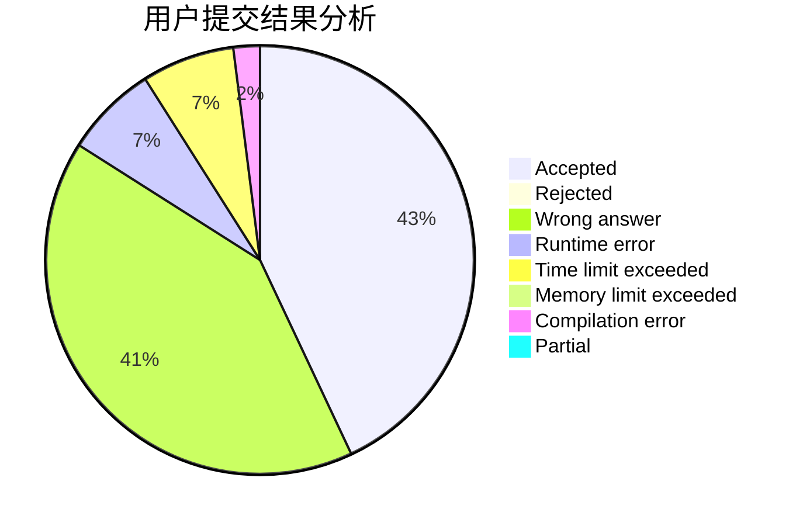
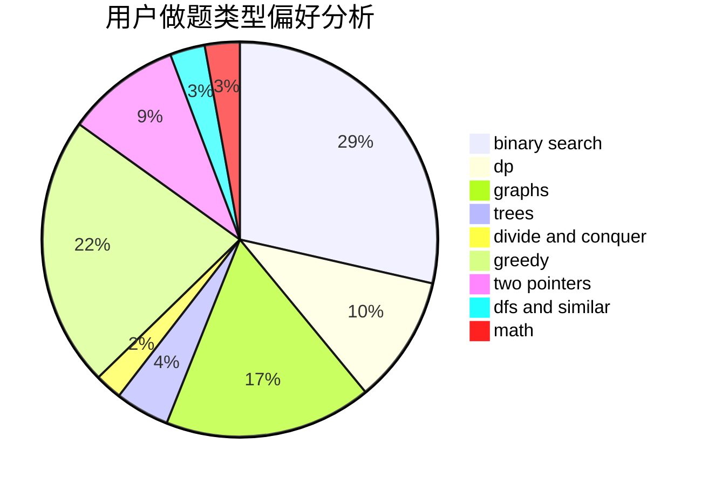

# Chen_zhuozhuo

<!-- tabs:start -->

#### **用户提交结果分析**

#### **用户做题类型偏好分析**

<!-- tabs:end -->
# 推荐题目
[282C](https://codeforces.com/contest/282/problem/C)
[576C](https://codeforces.com/contest/576/problem/C)
[1269D](https://codeforces.com/contest/1269/problem/D)
[34D](https://codeforces.com/contest/34/problem/D)
[1136D](https://codeforces.com/contest/1136/problem/D)
[703C](https://codeforces.com/contest/703/problem/C)
[703A](https://codeforces.com/contest/703/problem/A)
[1439D](https://codeforces.com/contest/1439/problem/D)
[11781](https://codeforces.com/contest/1178/problem/1)
[1228C](https://codeforces.com/contest/1228/problem/C)
