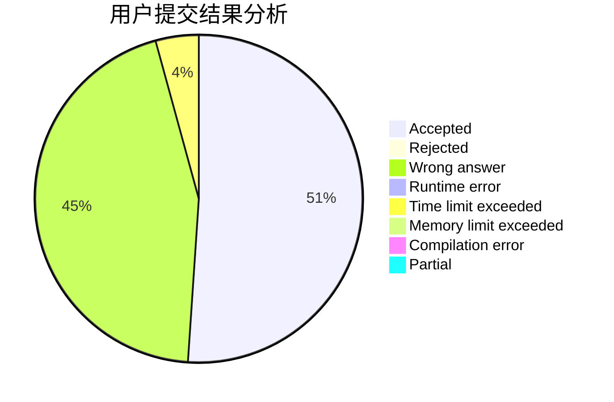
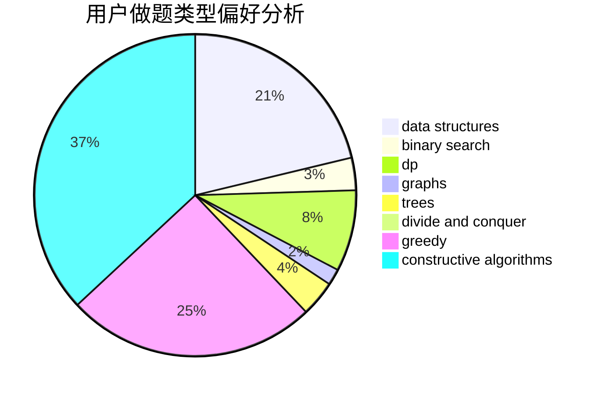

# zjlywjn

<!-- tabs:start -->

#### **用户提交结果分析**

#### **用户做题类型偏好分析**

#### **用户错题知识点分析**

<!-- tabs:end -->
# 推荐题目
[1478A](https://codeforces.com/contest/1478/problem/A)		brute force,
                        greedy		  
[1361D](https://codeforces.com/contest/1361/problem/D)		greedy,
                        implementation,
                        math,
                        trees		  
[1285D](https://codeforces.com/contest/1285/problem/D)		bitmasks,
                        brute force,
                        dfs and similar,
                        divide and conquer,
                        dp,
                        greedy,
                        strings,
                        trees		  
[676D](https://codeforces.com/contest/676/problem/D)		graphs,
                        implementation,
                        shortest paths		  
[865G](https://codeforces.com/contest/865/problem/G)		combinatorics,
                        math,
                        matrices		  
[809B](https://codeforces.com/contest/809/problem/B)		binary search,
                        interactive		  
[1092F](https://codeforces.com/contest/1092/problem/F)		dfs and similar,
                        dp,
                        trees		  
[53D](https://codeforces.com/contest/53/problem/D)		sortings		  
[1451C](https://codeforces.com/contest/1451/problem/C)		dp,
                        greedy,
                        hashing,
                        implementation,
                        strings		  
[1369B](https://codeforces.com/contest/1369/problem/B)		greedy,
                        implementation,
                        strings		  
