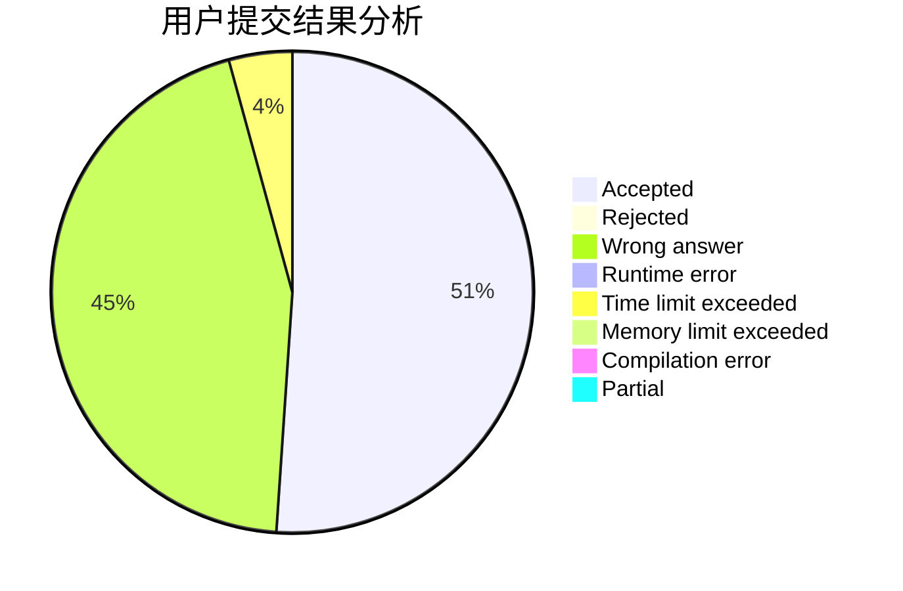
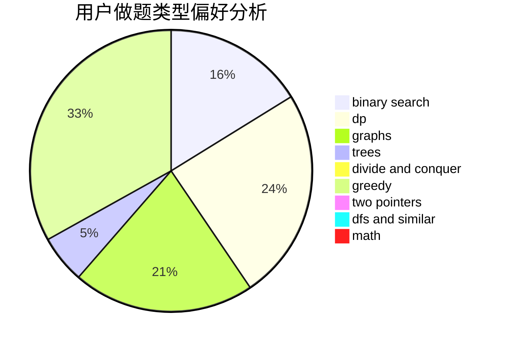

# zjlywjn

<!-- tabs:start -->

#### **用户提交结果分析**

#### **用户做题类型偏好分析**

<!-- tabs:end -->
# 推荐题目
[1486E](https://codeforces.com/contest/1486/problem/E)
[1369D](https://codeforces.com/contest/1369/problem/D)
[1292E](https://codeforces.com/contest/1292/problem/E)
[700D](https://codeforces.com/contest/700/problem/D)
[886C](https://codeforces.com/contest/886/problem/C)
[827A](https://codeforces.com/contest/827/problem/A)
[1093C](https://codeforces.com/contest/1093/problem/C)
[560A](https://codeforces.com/contest/560/problem/A)
[145C](https://codeforces.com/contest/145/problem/C)
[13761](https://codeforces.com/contest/1376/problem/1)
