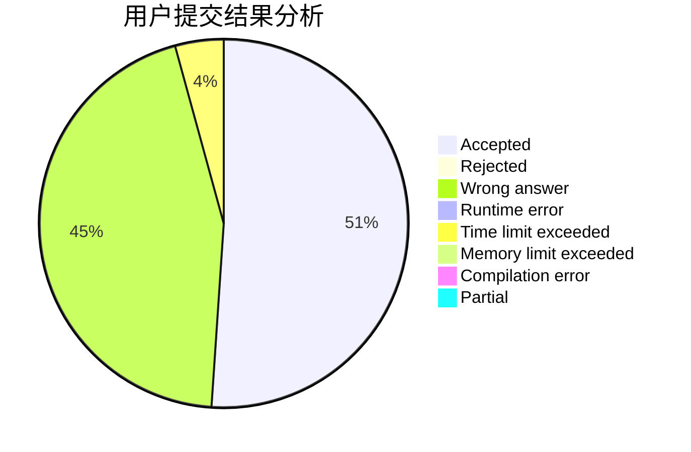
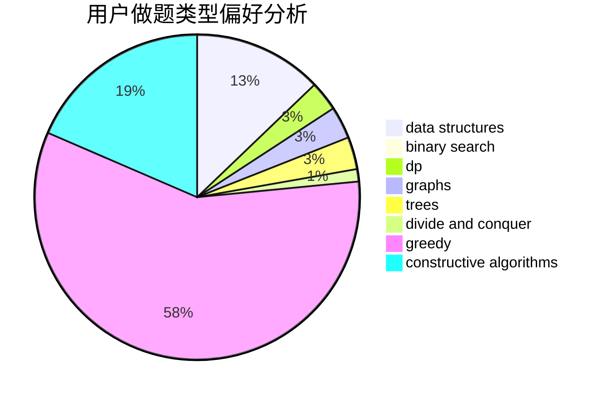

# zjlywjn

<!-- tabs:start -->

#### **用户提交结果分析**

#### **用户做题类型偏好分析**

#### **用户错题知识点分析**

<!-- tabs:end -->
# 推荐题目
[1486E](https://codeforces.com/contest/1486/problem/E)		binary search,
                        brute force,
                        constructive algorithms,
                        dp,
                        flows,
                        graphs,
                        shortest paths		  
[1369D](https://codeforces.com/contest/1369/problem/D)		dp,
                        graphs,
                        greedy,
                        math,
                        trees		  
[1292E](https://codeforces.com/contest/1292/problem/E)		constructive algorithms,
                        greedy,
                        interactive,
                        math		  
[700D](https://codeforces.com/contest/700/problem/D)		data structures,
                        greedy		  
[886C](https://codeforces.com/contest/886/problem/C)		dsu,
                        greedy,
                        implementation,
                        trees		  
[827A](https://codeforces.com/contest/827/problem/A)		data structures,
                        greedy,
                        sortings,
                        strings		  
[1093C](https://codeforces.com/contest/1093/problem/C)		greedy		  
[560A](https://codeforces.com/contest/560/problem/A)		implementation,
                        sortings		  
[145C](https://codeforces.com/contest/145/problem/C)		combinatorics,
                        dp,
                        math		  
[13761](https://codeforces.com/contest/1376/problem/1)		dsu,graphs,sortings,trees		  
