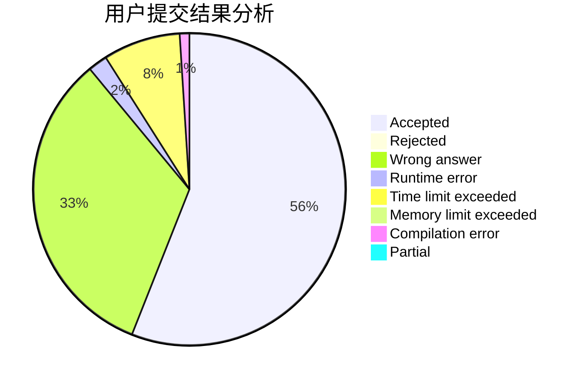
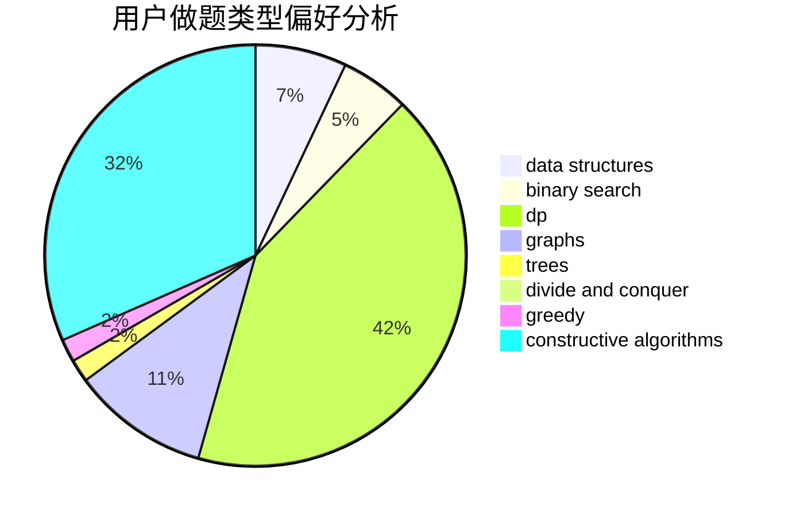
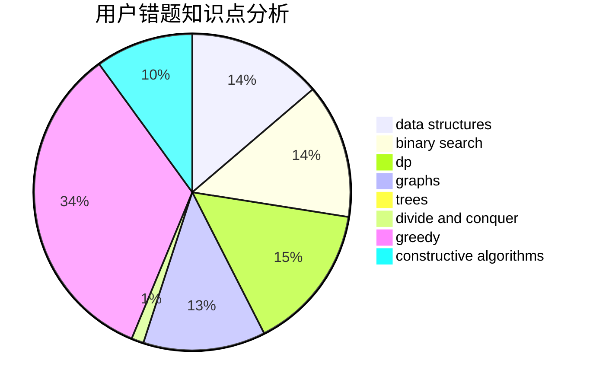

# zjsxzy

<!-- tabs:start -->

#### **用户提交结果分析**

#### **用户做题类型偏好分析**

#### **用户错题知识点分析**

<!-- tabs:end -->
# 推荐题目
[1088B](https://codeforces.com/contest/1088/problem/B)		implementation,
                        sortings		  
[402D](https://codeforces.com/contest/402/problem/D)		dp,
                        greedy,
                        math,
                        number theory		  
[1510H](https://codeforces.com/contest/1510/problem/H)		dp		  
[919E](https://codeforces.com/contest/919/problem/E)		chinese remainder theorem,
                        math,
                        number theory		  
[65A](https://codeforces.com/contest/65/problem/A)		implementation,
                        math		  
[13492](https://codeforces.com/contest/1349/problem/2)		dsu,graphs,sortings,trees		  
[448C](https://codeforces.com/contest/448/problem/C)		divide and conquer,
                        dp,
                        greedy		  
[1413A](https://codeforces.com/contest/1413/problem/A)		constructive algorithms,
                        math		  
[1290B](https://codeforces.com/contest/1290/problem/B)		binary search,
                        constructive algorithms,
                        data structures,
                        strings,
                        two pointers		  
[1442E](https://codeforces.com/contest/1442/problem/E)		binary search,
                        constructive algorithms,
                        dfs and similar,
                        dp,
                        greedy,
                        trees		  
