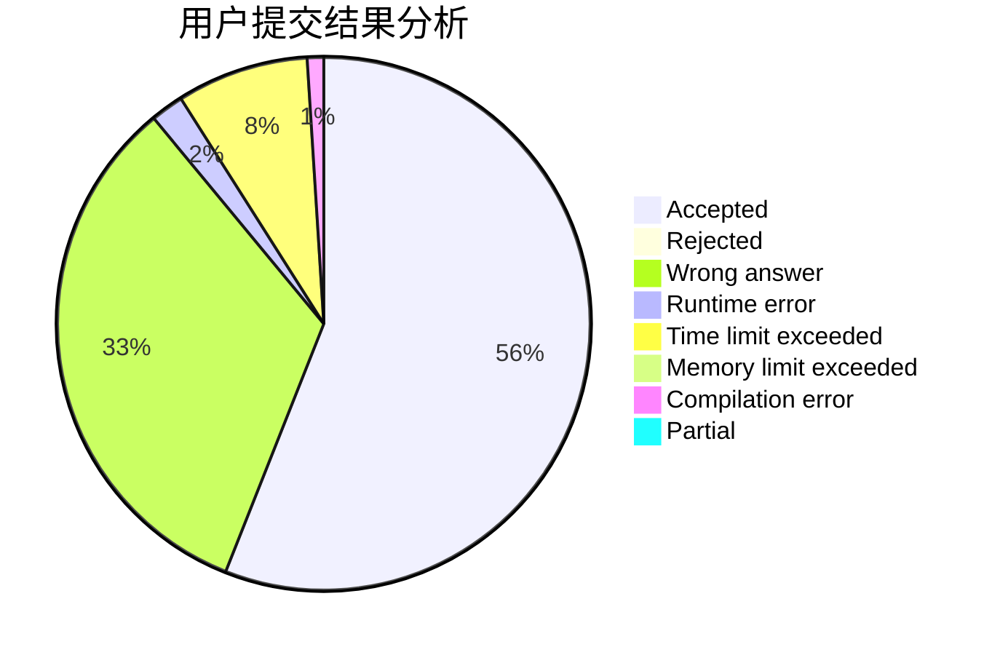
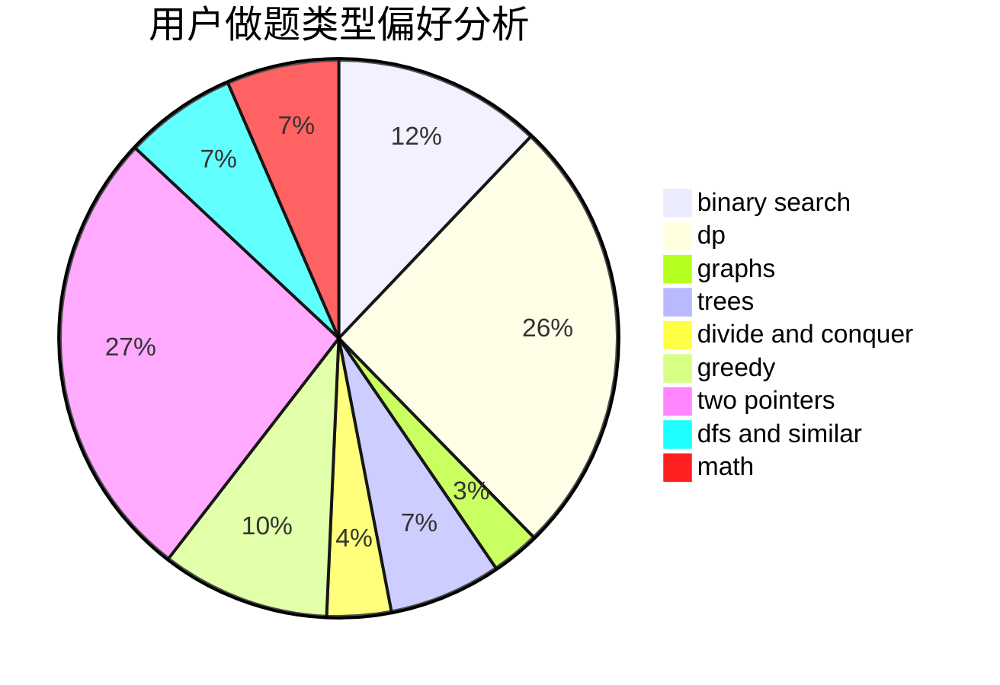

# zjsxzy

<!-- tabs:start -->

#### **用户提交结果分析**

#### **用户做题类型偏好分析**

<!-- tabs:end -->
# 推荐题目
[1088B](https://codeforces.com/contest/1088/problem/B)
[402D](https://codeforces.com/contest/402/problem/D)
[1510H](https://codeforces.com/contest/1510/problem/H)
[919E](https://codeforces.com/contest/919/problem/E)
[65A](https://codeforces.com/contest/65/problem/A)
[13492](https://codeforces.com/contest/1349/problem/2)
[448C](https://codeforces.com/contest/448/problem/C)
[1413A](https://codeforces.com/contest/1413/problem/A)
[1290B](https://codeforces.com/contest/1290/problem/B)
[1442E](https://codeforces.com/contest/1442/problem/E)
