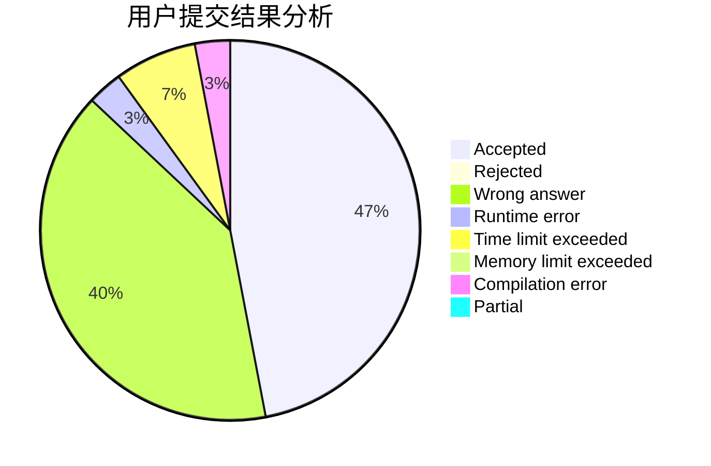
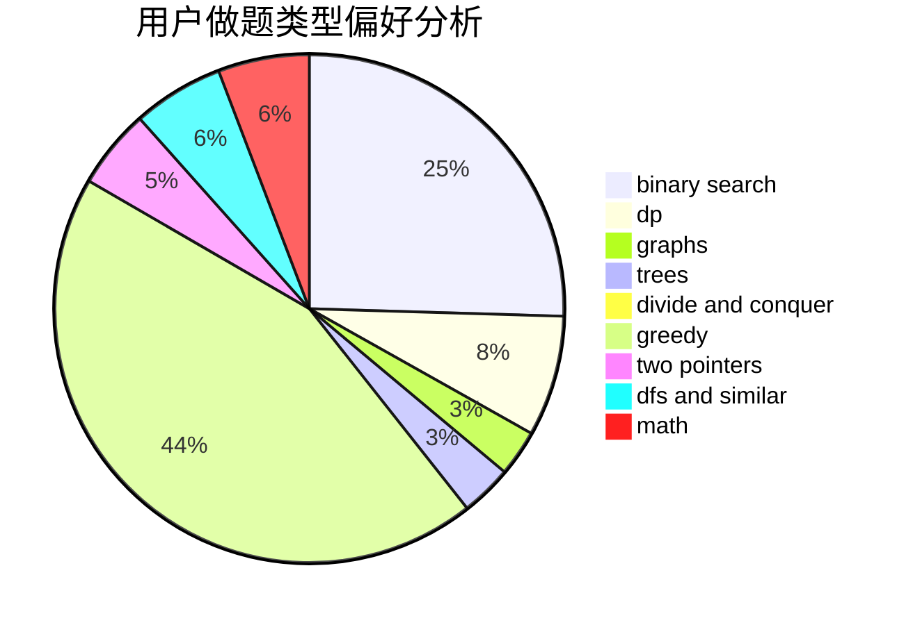

# zjutwyy

<!-- tabs:start -->

#### **用户提交结果分析**

#### **用户做题类型偏好分析**

<!-- tabs:end -->
# 推荐题目
[676D](https://codeforces.com/contest/676/problem/D)
[1312E](https://codeforces.com/contest/1312/problem/E)
[1013E](https://codeforces.com/contest/1013/problem/E)
[762A](https://codeforces.com/contest/762/problem/A)
[1294F](https://codeforces.com/contest/1294/problem/F)
[486C](https://codeforces.com/contest/486/problem/C)
[1385G](https://codeforces.com/contest/1385/problem/G)
[501C](https://codeforces.com/contest/501/problem/C)
[1213F](https://codeforces.com/contest/1213/problem/F)
[906A](https://codeforces.com/contest/906/problem/A)
