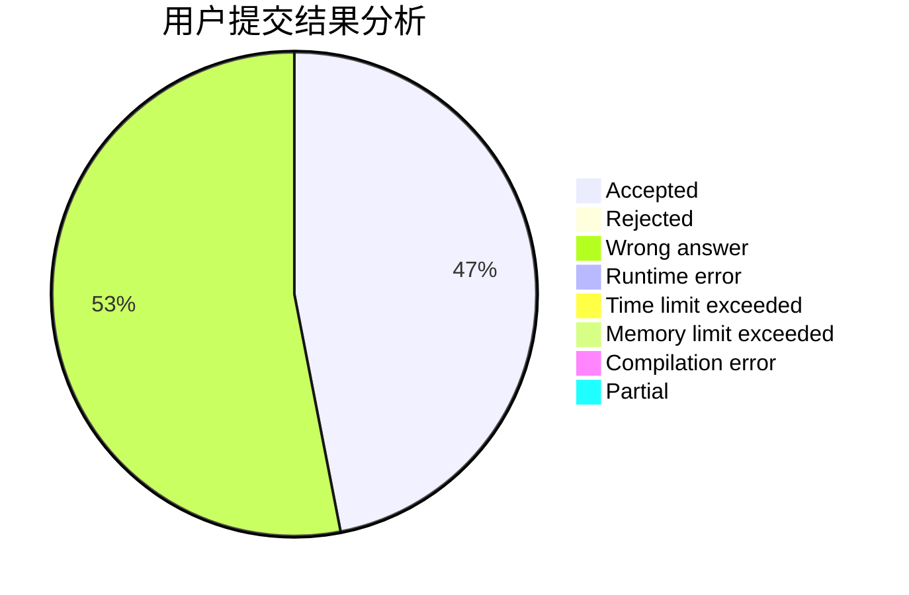
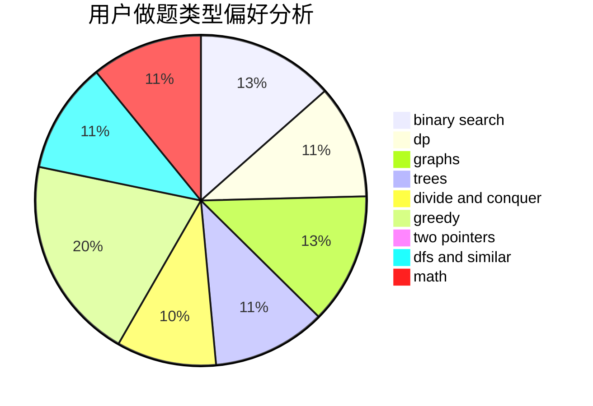

# zjw

<!-- tabs:start -->

#### **用户提交结果分析**

#### **用户做题类型偏好分析**

<!-- tabs:end -->
# 推荐题目
[1428B](https://codeforces.com/contest/1428/problem/B)
[912C](https://codeforces.com/contest/912/problem/C)
[35A](https://codeforces.com/contest/35/problem/A)
[608D](https://codeforces.com/contest/608/problem/D)
[1020A](https://codeforces.com/contest/1020/problem/A)
[13352](https://codeforces.com/contest/1335/problem/2)
[12271](https://codeforces.com/contest/1227/problem/1)
[631D](https://codeforces.com/contest/631/problem/D)
[498B](https://codeforces.com/contest/498/problem/B)
[769A](https://codeforces.com/contest/769/problem/A)
