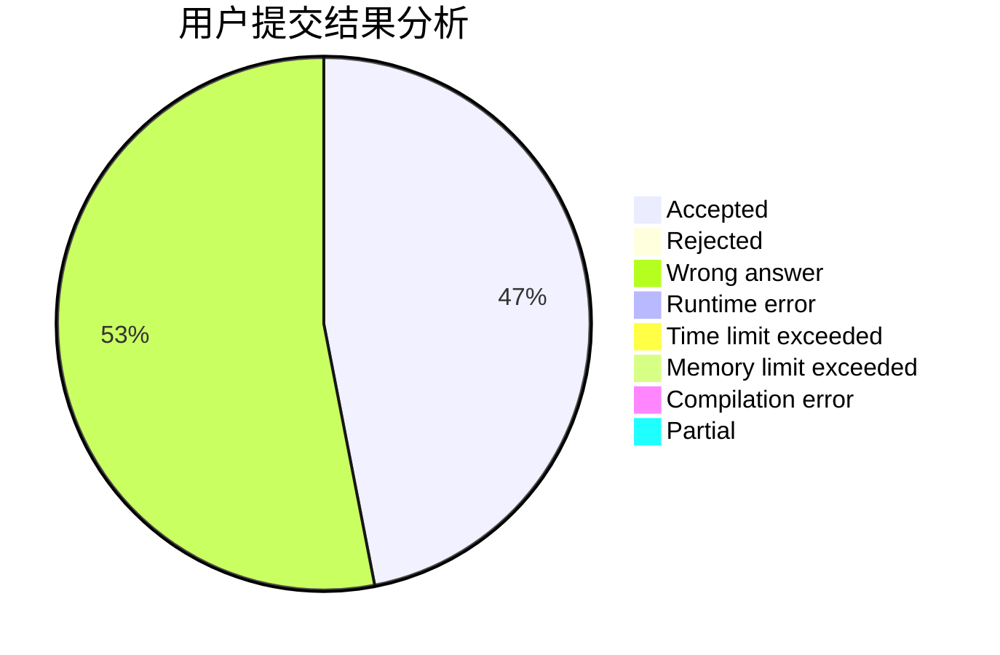
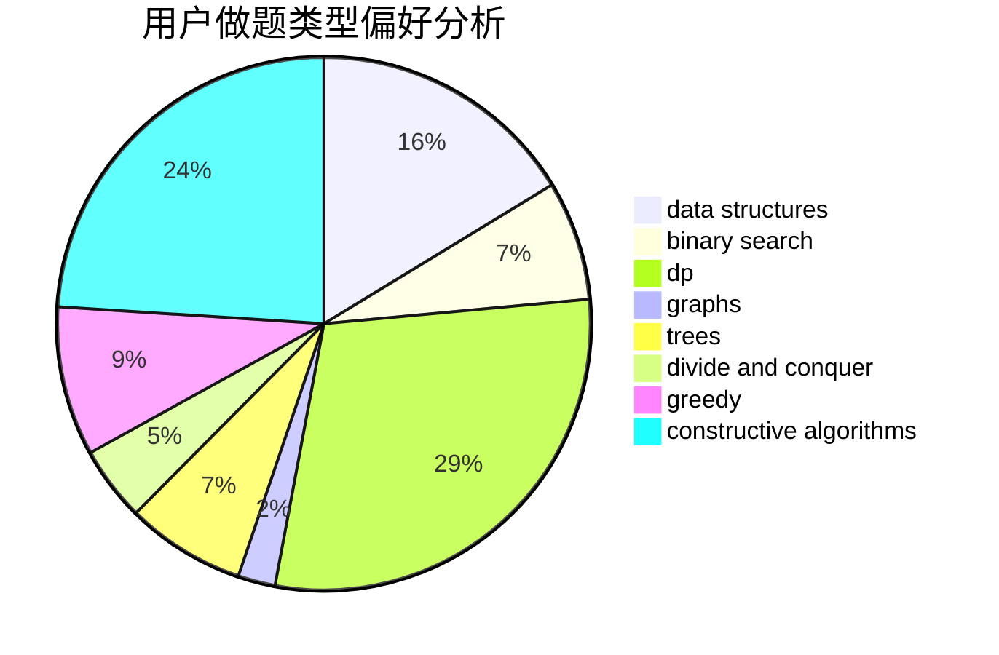
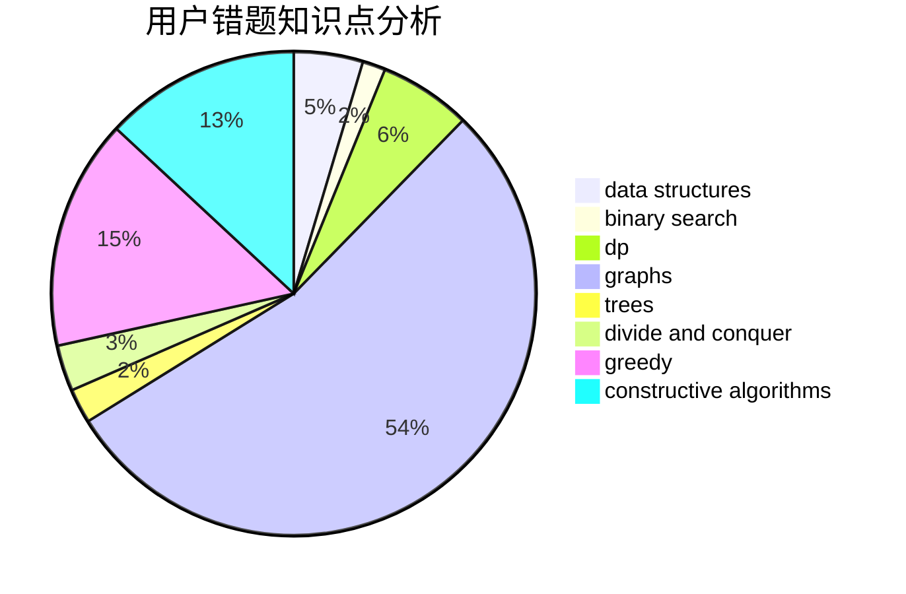

# zjw

<!-- tabs:start -->

#### **用户提交结果分析**

#### **用户做题类型偏好分析**

#### **用户错题知识点分析**

<!-- tabs:end -->
# 推荐题目
[1420D](https://codeforces.com/contest/1420/problem/D)		combinatorics,
                        data structures,
                        sortings		  
[894D](https://codeforces.com/contest/894/problem/D)		brute force,
                        data structures,
                        trees		  
[331E1](https://codeforces.com/contest/331E/problem/1)		constructive algorithms,
                        graphs,
                        implementation		  
[588B](https://codeforces.com/contest/588/problem/B)		math		  
[1019E](https://codeforces.com/contest/1019/problem/E)		data structures,
                        divide and conquer,
                        trees		  
[1328F](https://codeforces.com/contest/1328/problem/F)		greedy		  
[1219B](https://codeforces.com/contest/1219/problem/B)		dsu,graphs,sortings,trees		  
[612B](https://codeforces.com/contest/612/problem/B)		implementation,
                        math		  
[478B](https://codeforces.com/contest/478/problem/B)		combinatorics,
                        constructive algorithms,
                        greedy,
                        math		  
[74B](https://codeforces.com/contest/74/problem/B)		dp,
                        games,
                        greedy		  
