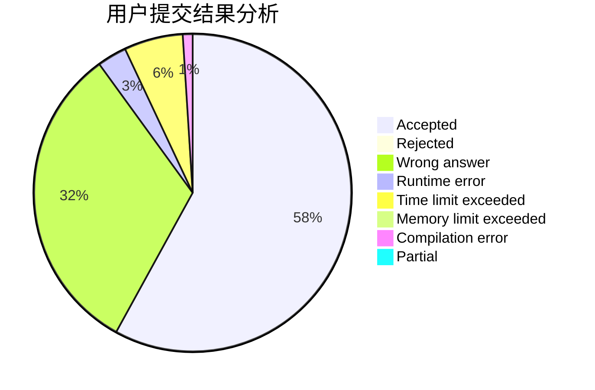
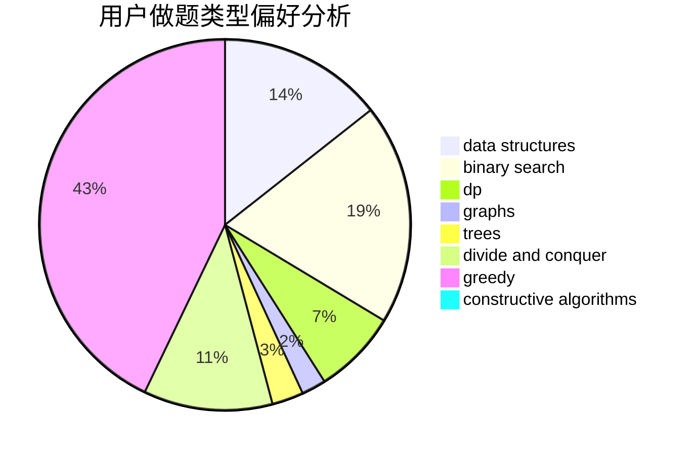
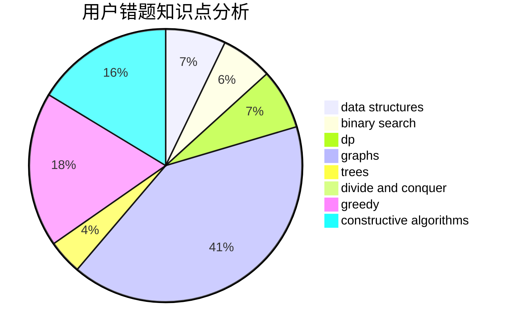

# zjx_cc

<!-- tabs:start -->

#### **用户提交结果分析**

#### **用户做题类型偏好分析**

#### **用户错题知识点分析**

<!-- tabs:end -->
# 推荐题目
[1220B](https://codeforces.com/contest/1220/problem/B)		math,
                        number theory		  
[507B](https://codeforces.com/contest/507/problem/B)		geometry,
                        math		  
[1120F](https://codeforces.com/contest/1120/problem/F)		data structures,
                        dp,
                        greedy		  
[95A](https://codeforces.com/contest/95/problem/A)		implementation,
                        strings		  
[1394E](https://codeforces.com/contest/1394/problem/E)		strings		  
[848B](https://codeforces.com/contest/848/problem/B)		constructive algorithms,
                        data structures,
                        geometry,
                        implementation,
                        sortings,
                        two pointers		  
[630F](https://codeforces.com/contest/630/problem/F)		combinatorics,
                        math		  
[946C](https://codeforces.com/contest/946/problem/C)		greedy,
                        strings		  
[1070A](https://codeforces.com/contest/1070/problem/A)		dp,
                        graphs,
                        number theory,
                        shortest paths		  
[464B](https://codeforces.com/contest/464/problem/B)		brute force,
                        geometry		  
