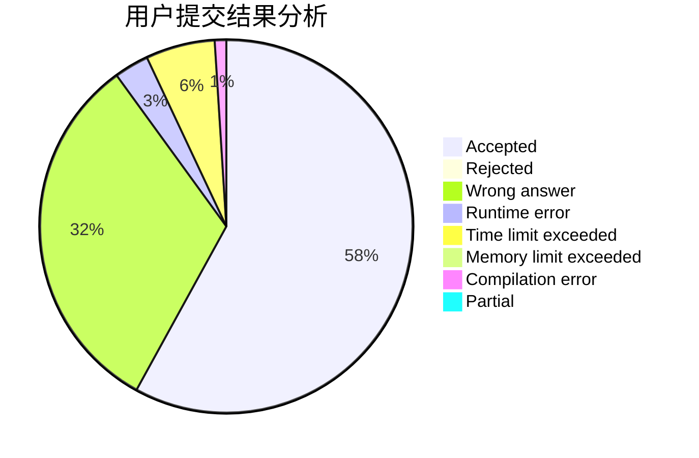
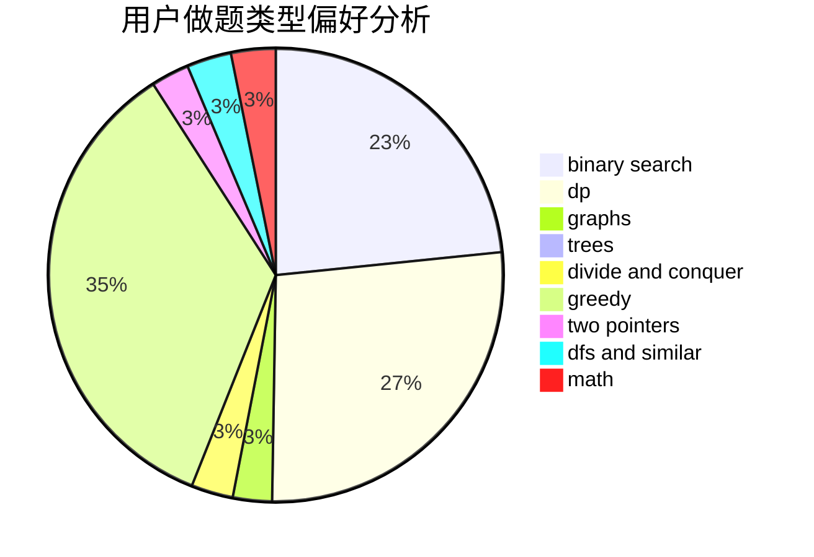

# zjx_cc

<!-- tabs:start -->

#### **用户提交结果分析**

#### **用户做题类型偏好分析**

<!-- tabs:end -->
# 推荐题目
[1228B](https://codeforces.com/contest/1228/problem/B)
[527C](https://codeforces.com/contest/527/problem/C)
[11302](https://codeforces.com/contest/1130/problem/2)
[981E](https://codeforces.com/contest/981/problem/E)
[1403A](https://codeforces.com/contest/1403/problem/A)
[866E](https://codeforces.com/contest/866/problem/E)
[660B](https://codeforces.com/contest/660/problem/B)
[962G](https://codeforces.com/contest/962/problem/G)
[1070D](https://codeforces.com/contest/1070/problem/D)
[484A](https://codeforces.com/contest/484/problem/A)
