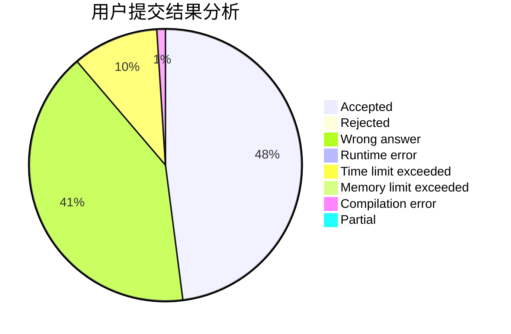
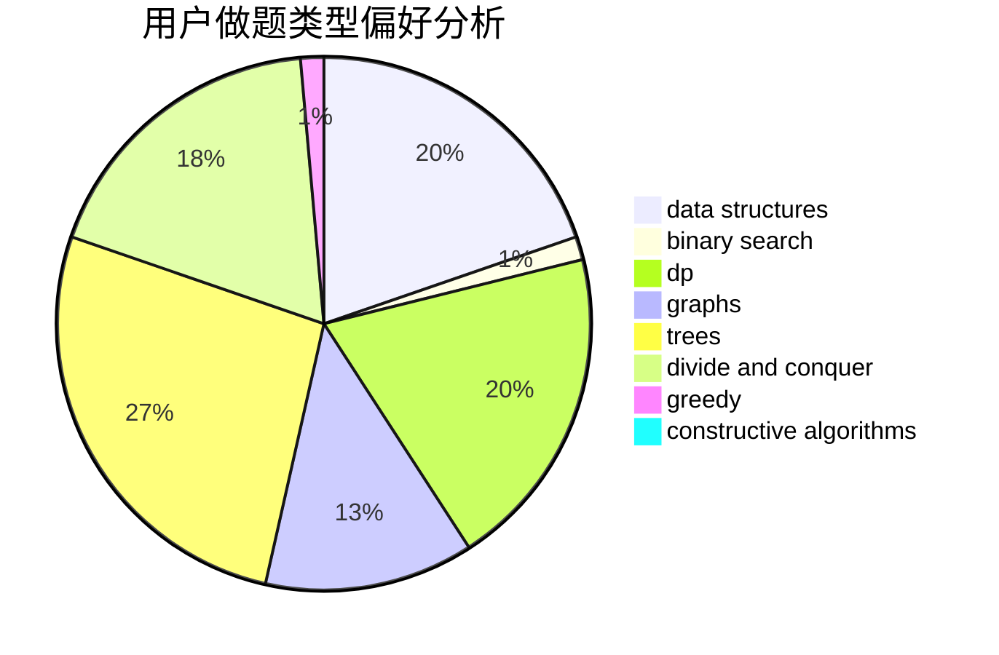
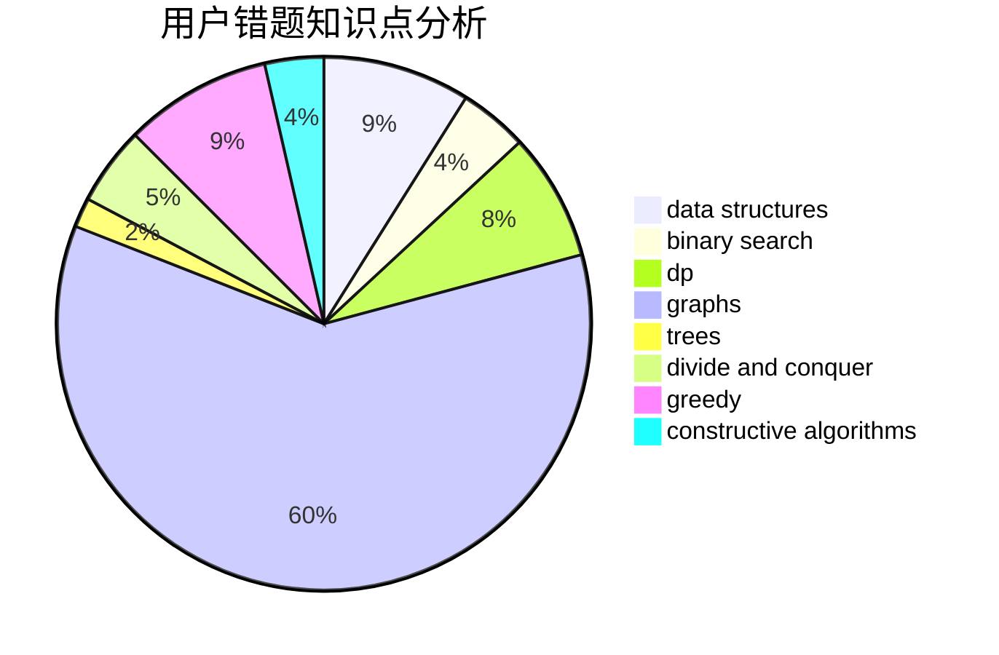

# zlczlc

<!-- tabs:start -->

#### **用户提交结果分析**

#### **用户做题类型偏好分析**

#### **用户错题知识点分析**

<!-- tabs:end -->
# 推荐题目
[710D](https://codeforces.com/contest/710/problem/D)		math,
                        number theory		  
[802A](https://codeforces.com/contest/802/problem/A)		greedy		  
[1386A](https://codeforces.com/contest/1386/problem/A)		*special problem,
                        binary search,
                        constructive algorithms,
                        interactive		  
[617B](https://codeforces.com/contest/617/problem/B)		combinatorics		  
[1156A](https://codeforces.com/contest/1156/problem/A)		geometry		  
[920C](https://codeforces.com/contest/920/problem/C)		dfs and similar,
                        greedy,
                        math,
                        sortings,
                        two pointers		  
[353E](https://codeforces.com/contest/353/problem/E)		dp,
                        graph matchings,
                        greedy		  
[447E](https://codeforces.com/contest/447/problem/E)		dsu,graphs,sortings,trees		  
[1030D](https://codeforces.com/contest/1030/problem/D)		geometry,
                        number theory		  
[1499D](https://codeforces.com/contest/1499/problem/D)		dp,
                        math,
                        number theory		  
