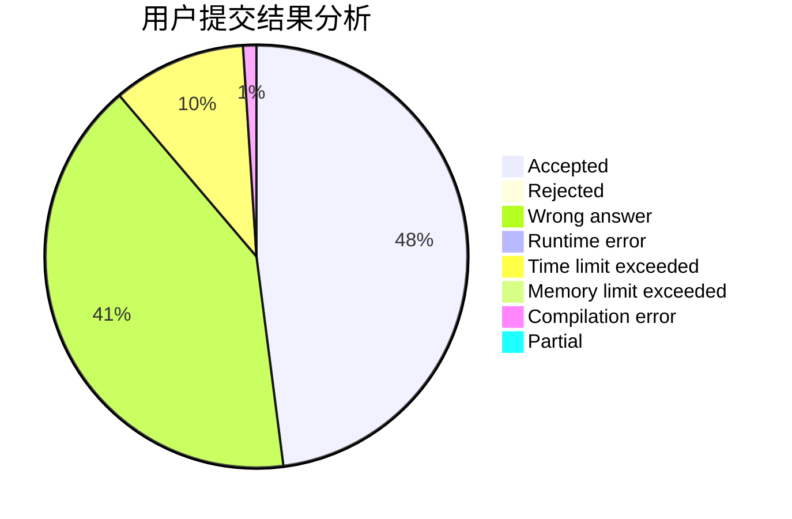
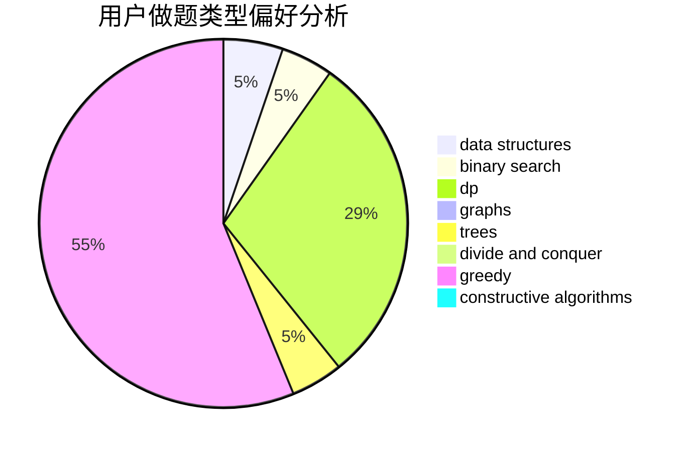
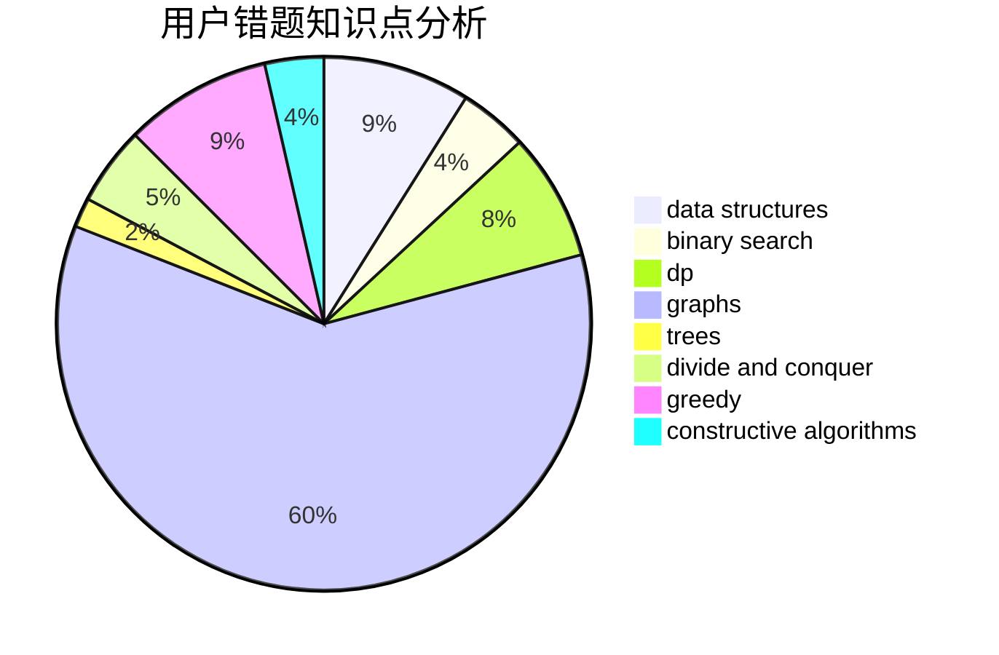

# zlczlc

<!-- tabs:start -->

#### **用户提交结果分析**

#### **用户做题类型偏好分析**

#### **用户错题知识点分析**

<!-- tabs:end -->
# 推荐题目
[690D1](https://codeforces.com/contest/690D/problem/1)		nan		  
[784E](https://codeforces.com/contest/784/problem/E)		*special problem,
                        brute force,
                        implementation		  
[1376B4](https://codeforces.com/contest/1376B/problem/4)		dsu,graphs,sortings,trees		  
[599C](https://codeforces.com/contest/599/problem/C)		sortings		  
[1154A](https://codeforces.com/contest/1154/problem/A)		math		  
[906E](https://codeforces.com/contest/906/problem/E)		dp,
                        string suffix structures,
                        strings		  
[323B](https://codeforces.com/contest/323/problem/B)		constructive algorithms,
                        graphs		  
[424D](https://codeforces.com/contest/424/problem/D)		binary search,
                        brute force,
                        constructive algorithms,
                        data structures,
                        dp		  
[1030A](https://codeforces.com/contest/1030/problem/A)		implementation		  
[1490E](https://codeforces.com/contest/1490/problem/E)		binary search,
                        data structures,
                        greedy		  
