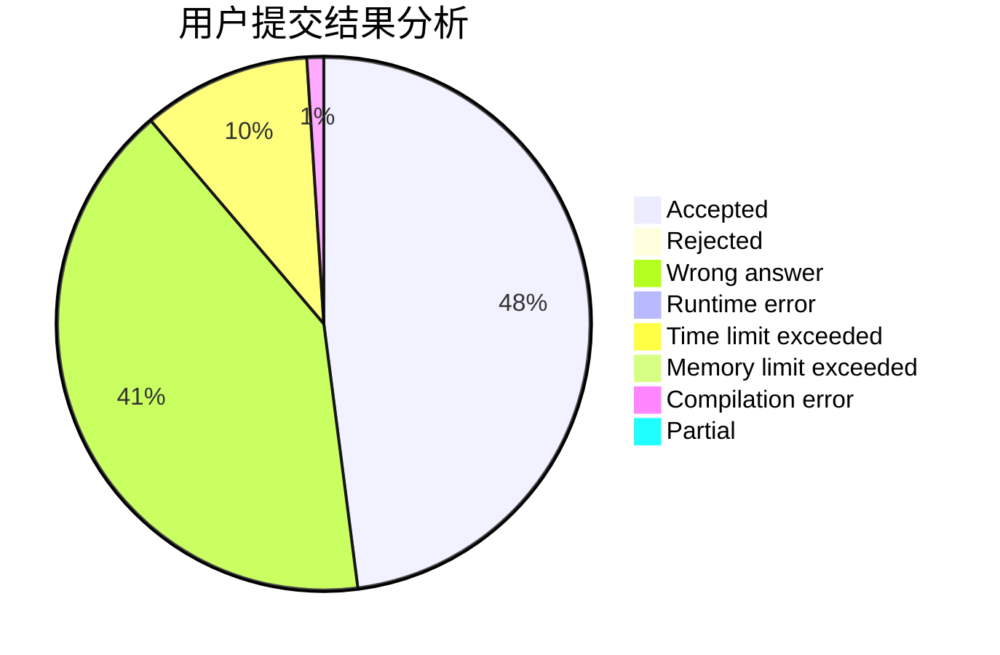
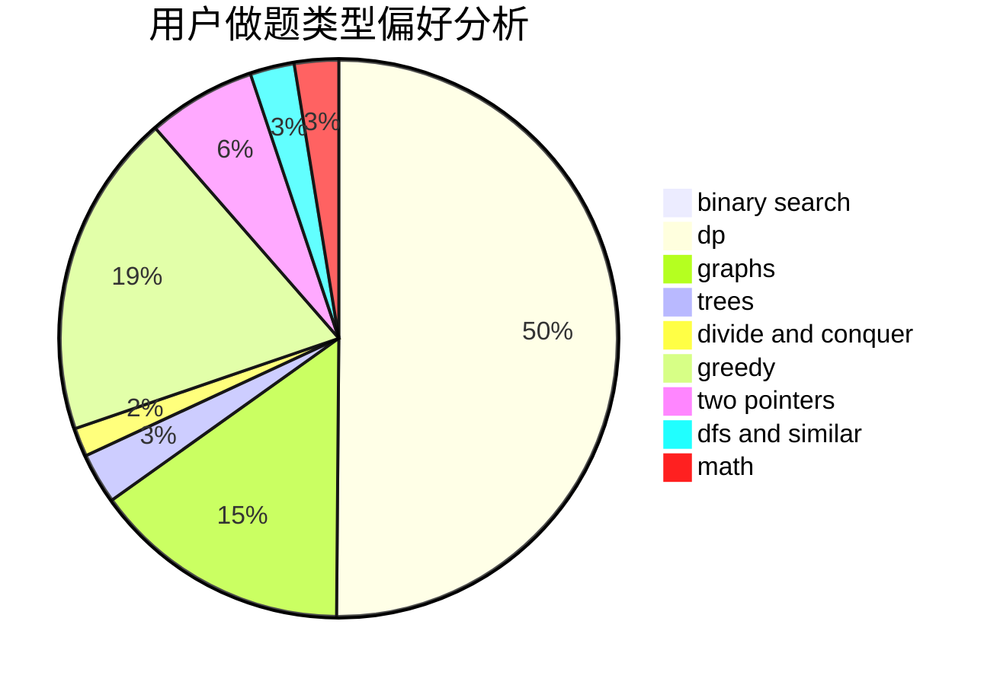

# zlczlc

<!-- tabs:start -->

#### **用户提交结果分析**

#### **用户做题类型偏好分析**

<!-- tabs:end -->
# 推荐题目
[710D](https://codeforces.com/contest/710/problem/D)
[802A](https://codeforces.com/contest/802/problem/A)
[1386A](https://codeforces.com/contest/1386/problem/A)
[617B](https://codeforces.com/contest/617/problem/B)
[1156A](https://codeforces.com/contest/1156/problem/A)
[920C](https://codeforces.com/contest/920/problem/C)
[353E](https://codeforces.com/contest/353/problem/E)
[447E](https://codeforces.com/contest/447/problem/E)
[1030D](https://codeforces.com/contest/1030/problem/D)
[1499D](https://codeforces.com/contest/1499/problem/D)
