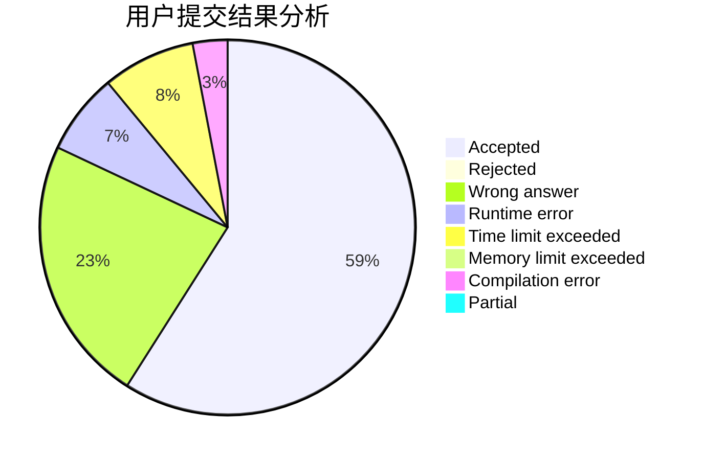
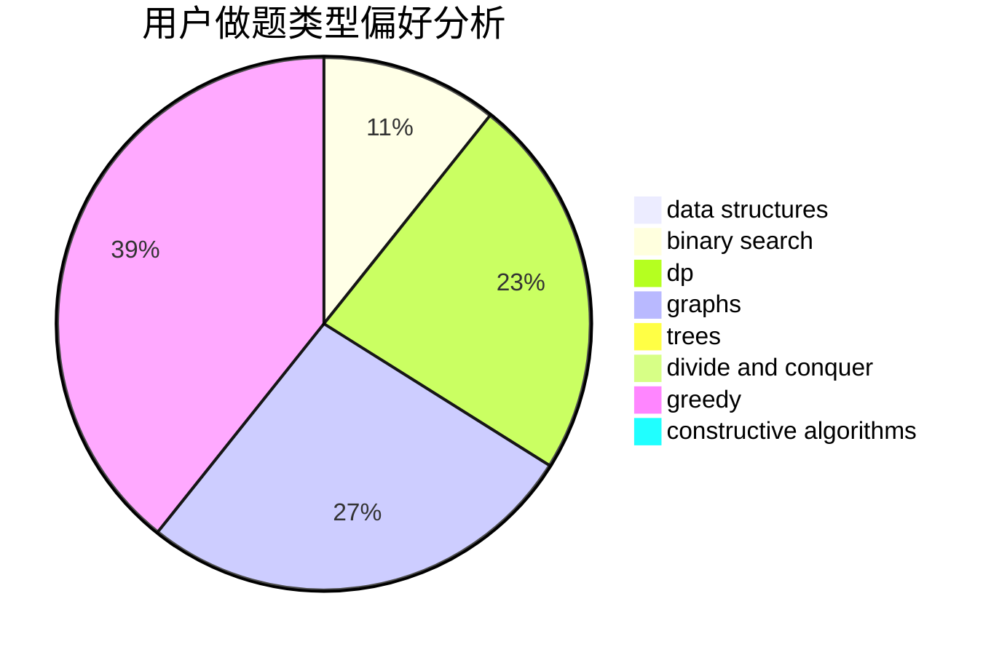
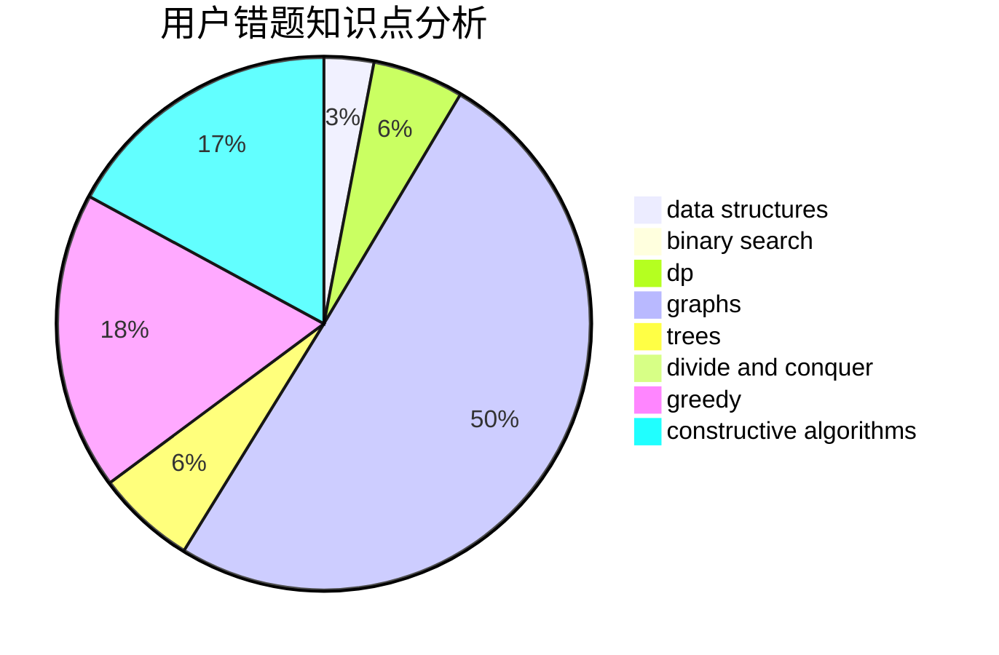

# zld3794955

<!-- tabs:start -->

#### **用户提交结果分析**

#### **用户做题类型偏好分析**

#### **用户错题知识点分析**

<!-- tabs:end -->
# 推荐题目
[863B](https://codeforces.com/contest/863/problem/B)		brute force,
                        greedy,
                        sortings		  
[594E](https://codeforces.com/contest/594/problem/E)		string suffix structures,
                        strings		  
[388E](https://codeforces.com/contest/388/problem/E)		geometry		  
[96B](https://codeforces.com/contest/96/problem/B)		binary search,
                        bitmasks,
                        brute force		  
[784B](https://codeforces.com/contest/784/problem/B)		*special problem		  
[1140E](https://codeforces.com/contest/1140/problem/E)		combinatorics,
                        divide and conquer,
                        dp		  
[315C](https://codeforces.com/contest/315/problem/C)		dsu,graphs,sortings,trees		  
[1296E1](https://codeforces.com/contest/1296E/problem/1)		constructive algorithms,
                        dp,
                        graphs,
                        greedy,
                        sortings		  
[1162C](https://codeforces.com/contest/1162/problem/C)		dsu,graphs,sortings,trees		  
[1129E](https://codeforces.com/contest/1129/problem/E)		binary search,
                        interactive,
                        trees		  
