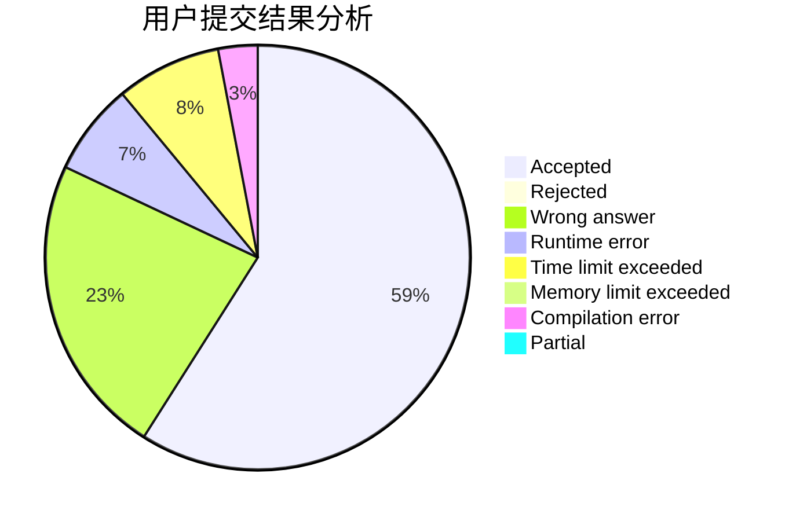
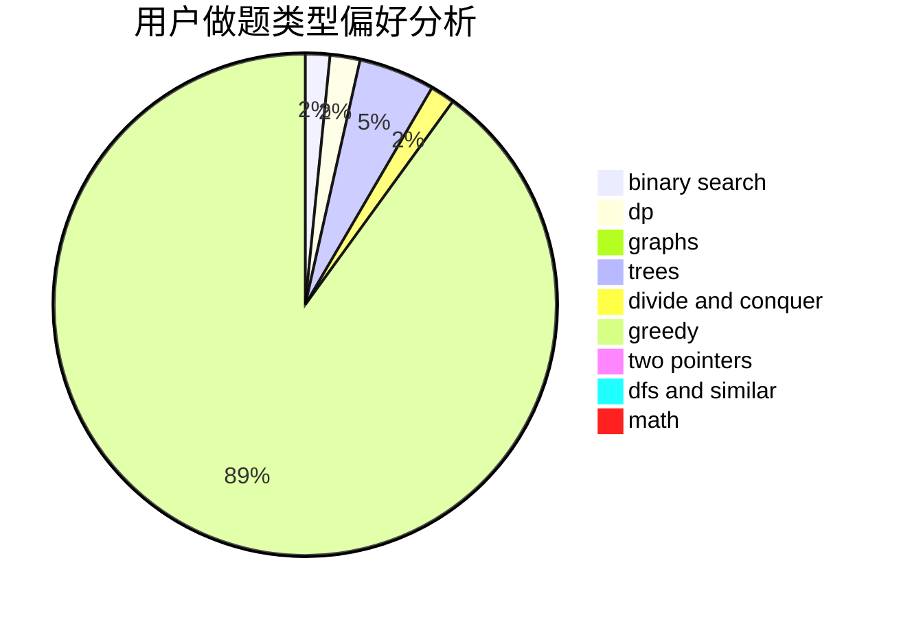

# zld3794955

<!-- tabs:start -->

#### **用户提交结果分析**

#### **用户做题类型偏好分析**

<!-- tabs:end -->
# 推荐题目
[883D](https://codeforces.com/contest/883/problem/D)
[612F](https://codeforces.com/contest/612/problem/F)
[418B](https://codeforces.com/contest/418/problem/B)
[989D](https://codeforces.com/contest/989/problem/D)
[801B](https://codeforces.com/contest/801/problem/B)
[1142C](https://codeforces.com/contest/1142/problem/C)
[339D](https://codeforces.com/contest/339/problem/D)
[1303G](https://codeforces.com/contest/1303/problem/G)
[1164J](https://codeforces.com/contest/1164/problem/J)
[1131E](https://codeforces.com/contest/1131/problem/E)
