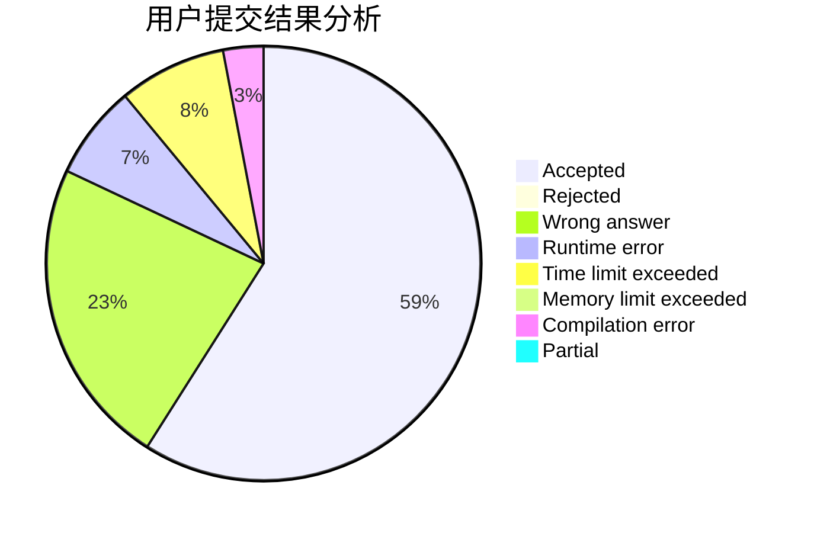
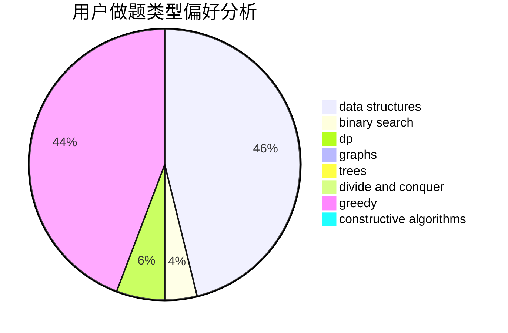
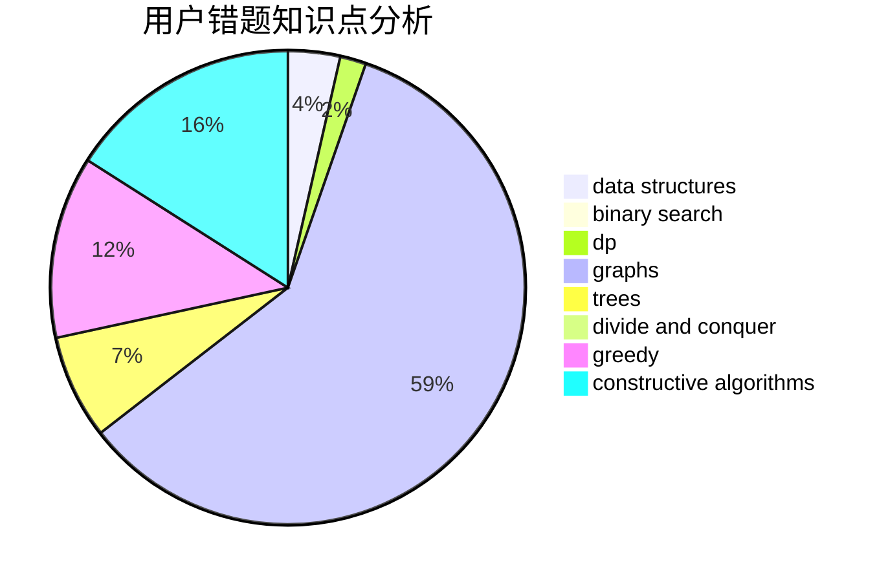

# zld3794955

<!-- tabs:start -->

#### **用户提交结果分析**

#### **用户做题类型偏好分析**

#### **用户错题知识点分析**

<!-- tabs:end -->
# 推荐题目
[883D](https://codeforces.com/contest/883/problem/D)		binary search,
                        dp,
                        math		  
[612F](https://codeforces.com/contest/612/problem/F)		dp		  
[418B](https://codeforces.com/contest/418/problem/B)		dsu,graphs,sortings,trees		  
[989D](https://codeforces.com/contest/989/problem/D)		binary search,
                        geometry,
                        math,
                        sortings,
                        two pointers		  
[801B](https://codeforces.com/contest/801/problem/B)		constructive algorithms,
                        greedy,
                        strings		  
[1142C](https://codeforces.com/contest/1142/problem/C)		geometry		  
[339D](https://codeforces.com/contest/339/problem/D)		data structures,
                        trees		  
[1303G](https://codeforces.com/contest/1303/problem/G)		data structures,
                        divide and conquer,
                        geometry,
                        trees		  
[1164J](https://codeforces.com/contest/1164/problem/J)		dsu,graphs,sortings,trees		  
[1131E](https://codeforces.com/contest/1131/problem/E)		dp,
                        greedy,
                        strings		  
