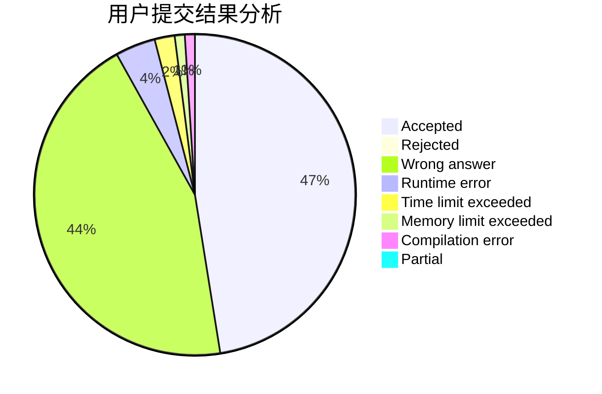
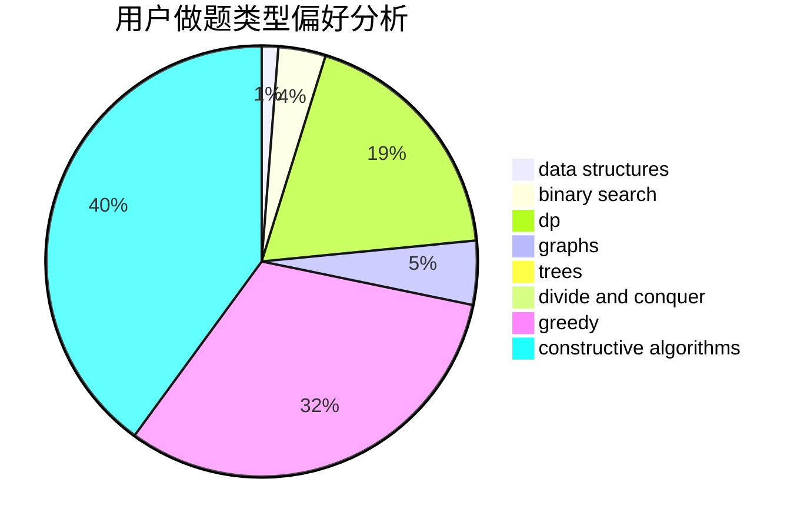
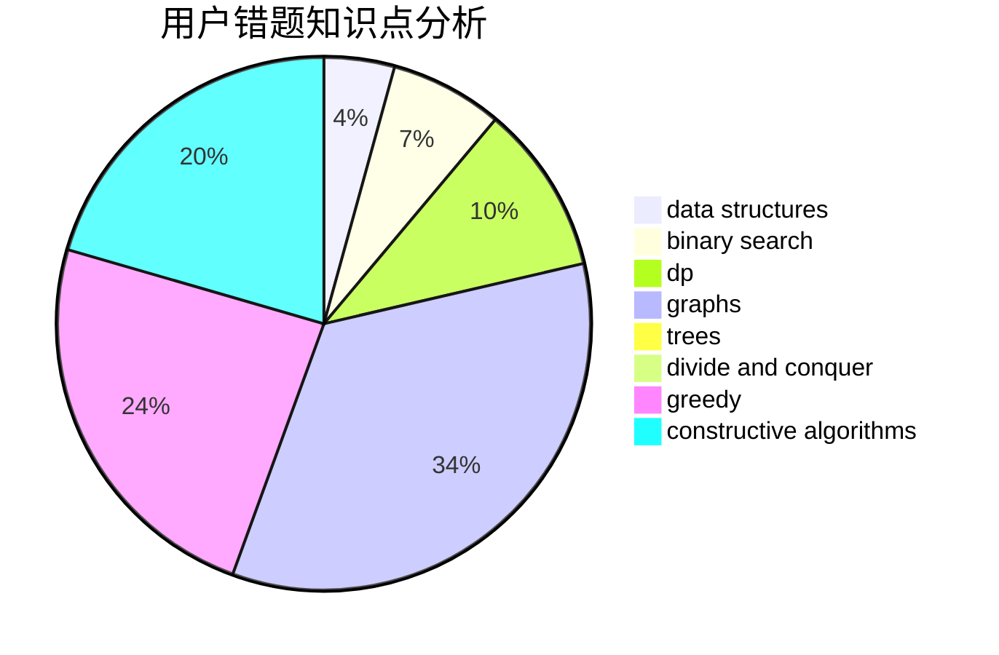

# zmwang

<!-- tabs:start -->

#### **用户提交结果分析**

#### **用户做题类型偏好分析**

#### **用户错题知识点分析**

<!-- tabs:end -->
# 推荐题目
[317A](https://codeforces.com/contest/317/problem/A)		brute force		  
[125D](https://codeforces.com/contest/125/problem/D)		constructive algorithms,
                        greedy		  
[1427D](https://codeforces.com/contest/1427/problem/D)		constructive algorithms,
                        implementation		  
[911C](https://codeforces.com/contest/911/problem/C)		brute force,
                        constructive algorithms		  
[1323A](https://codeforces.com/contest/1323/problem/A)		brute force,
                        dp,
                        greedy,
                        implementation		  
[498E](https://codeforces.com/contest/498/problem/E)		dp,
                        matrices		  
[88A](https://codeforces.com/contest/88/problem/A)		brute force,
                        implementation		  
[1129D](https://codeforces.com/contest/1129/problem/D)		data structures,
                        dp		  
[477E](https://codeforces.com/contest/477/problem/E)		data structures		  
[516C](https://codeforces.com/contest/516/problem/C)		dsu,graphs,sortings,trees		  
