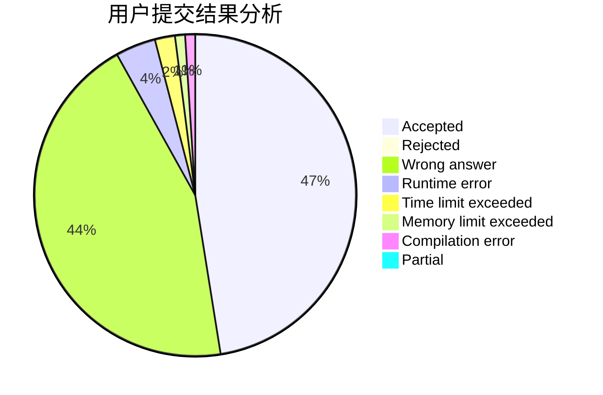
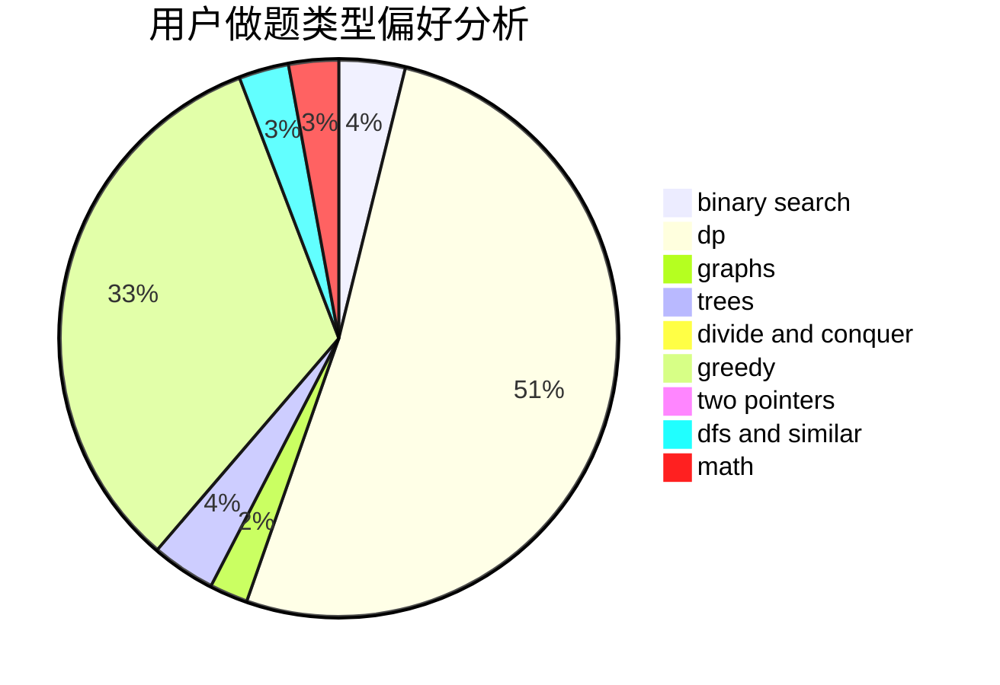

# zmwang

<!-- tabs:start -->

#### **用户提交结果分析**

#### **用户做题类型偏好分析**

<!-- tabs:end -->
# 推荐题目
[346B](https://codeforces.com/contest/346/problem/B)
[1265D](https://codeforces.com/contest/1265/problem/D)
[1436B](https://codeforces.com/contest/1436/problem/B)
[928B](https://codeforces.com/contest/928/problem/B)
[132C](https://codeforces.com/contest/132/problem/C)
[519E](https://codeforces.com/contest/519/problem/E)
[909A](https://codeforces.com/contest/909/problem/A)
[1131D](https://codeforces.com/contest/1131/problem/D)
[497E](https://codeforces.com/contest/497/problem/E)
[543C](https://codeforces.com/contest/543/problem/C)
