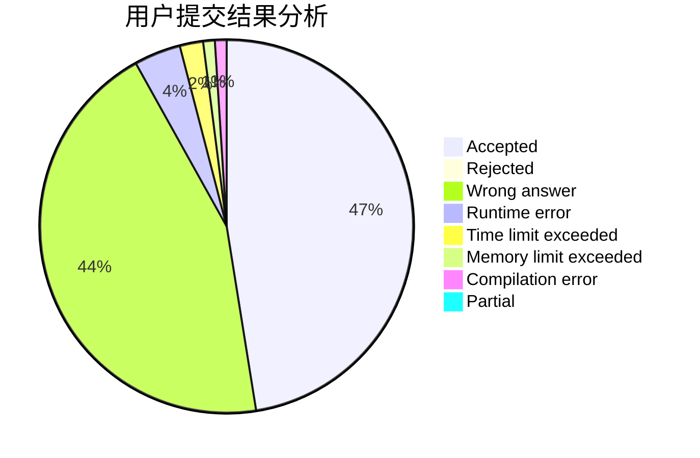
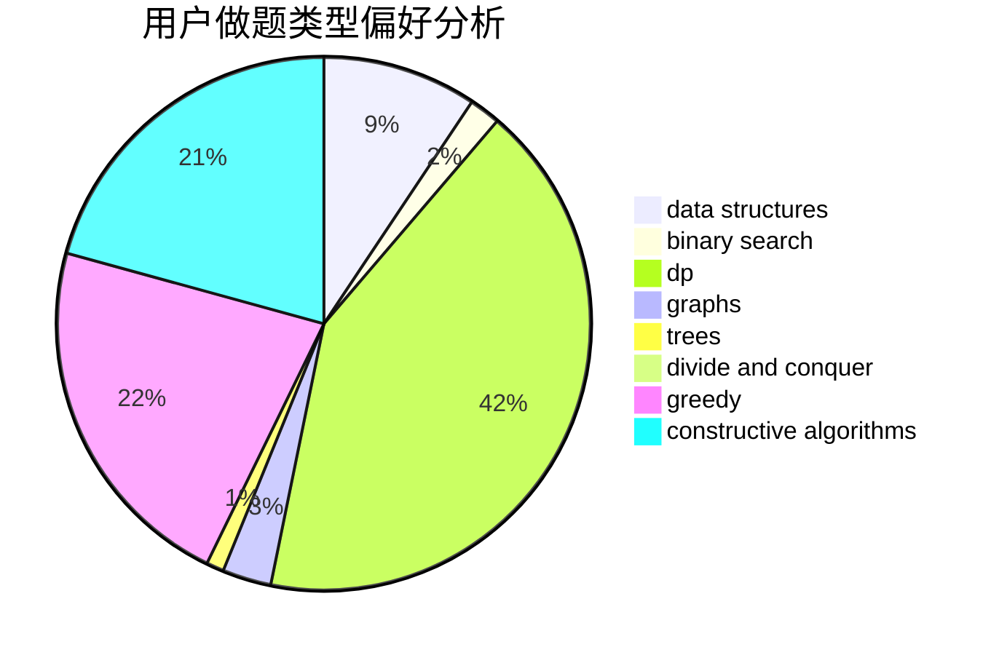
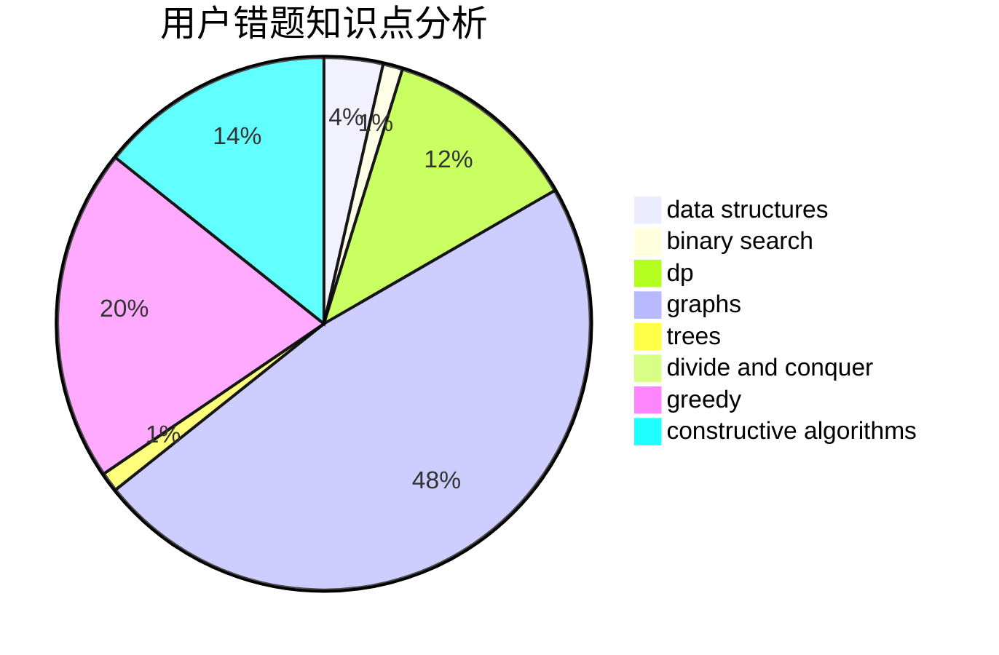

# zmwang

<!-- tabs:start -->

#### **用户提交结果分析**

#### **用户做题类型偏好分析**

#### **用户错题知识点分析**

<!-- tabs:end -->
# 推荐题目
[346B](https://codeforces.com/contest/346/problem/B)		dp,
                        strings		  
[1265D](https://codeforces.com/contest/1265/problem/D)		dsu,graphs,sortings,trees		  
[1436B](https://codeforces.com/contest/1436/problem/B)		constructive algorithms,
                        math		  
[928B](https://codeforces.com/contest/928/problem/B)		*special problem,
                        dp		  
[132C](https://codeforces.com/contest/132/problem/C)		dp		  
[519E](https://codeforces.com/contest/519/problem/E)		binary search,
                        data structures,
                        dfs and similar,
                        dp,
                        trees		  
[909A](https://codeforces.com/contest/909/problem/A)		brute force,
                        greedy,
                        sortings		  
[1131D](https://codeforces.com/contest/1131/problem/D)		dfs and similar,
                        dp,
                        dsu,
                        graphs,
                        greedy		  
[497E](https://codeforces.com/contest/497/problem/E)		dp,
                        matrices		  
[543C](https://codeforces.com/contest/543/problem/C)		bitmasks,
                        dp		  
