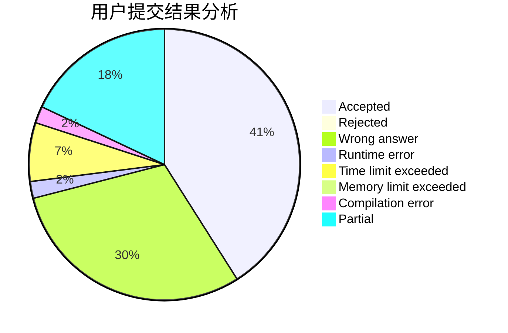
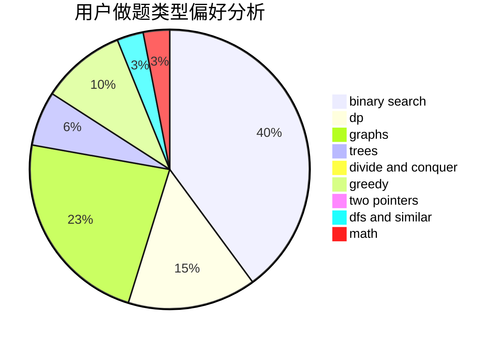

# zmy123456

<!-- tabs:start -->

#### **用户提交结果分析**

#### **用户做题类型偏好分析**

<!-- tabs:end -->
# 推荐题目
[911D](https://codeforces.com/contest/911/problem/D)
[490F](https://codeforces.com/contest/490/problem/F)
[15C](https://codeforces.com/contest/15/problem/C)
[1025F](https://codeforces.com/contest/1025/problem/F)
[437A](https://codeforces.com/contest/437/problem/A)
[828D](https://codeforces.com/contest/828/problem/D)
[1234F](https://codeforces.com/contest/1234/problem/F)
[1187B](https://codeforces.com/contest/1187/problem/B)
[258B](https://codeforces.com/contest/258/problem/B)
[402E](https://codeforces.com/contest/402/problem/E)
