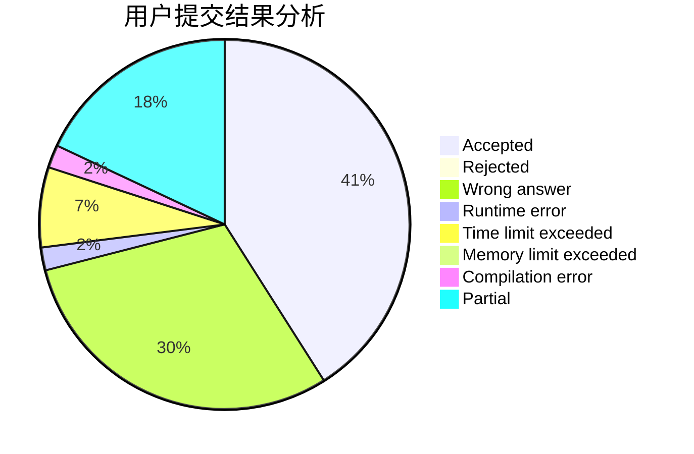
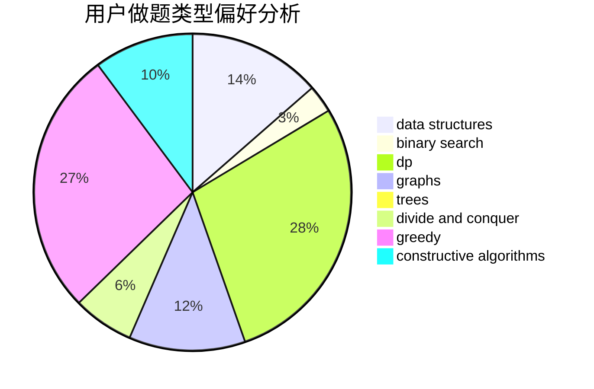
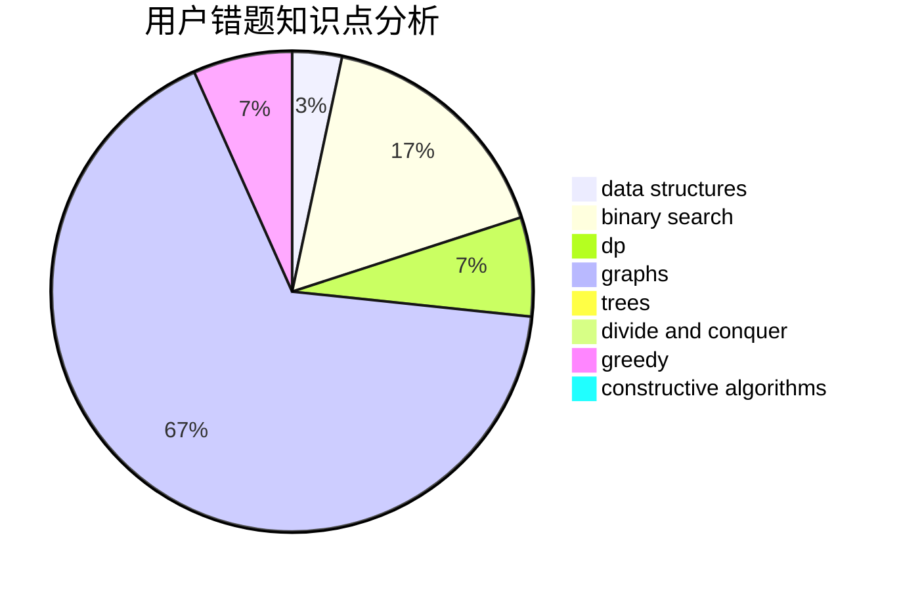

# zmy123456

<!-- tabs:start -->

#### **用户提交结果分析**

#### **用户做题类型偏好分析**

#### **用户错题知识点分析**

<!-- tabs:end -->
# 推荐题目
[893D](https://codeforces.com/contest/893/problem/D)		data structures,
                        dp,
                        greedy,
                        implementation		  
[472C](https://codeforces.com/contest/472/problem/C)		greedy		  
[1509A](https://codeforces.com/contest/1509/problem/A)		constructive algorithms		  
[1025C](https://codeforces.com/contest/1025/problem/C)		constructive algorithms,
                        implementation		  
[409G](https://codeforces.com/contest/409/problem/G)		*special problem,
                        geometry		  
[810D](https://codeforces.com/contest/810/problem/D)		dsu,graphs,sortings,trees		  
[1227B](https://codeforces.com/contest/1227/problem/B)		constructive algorithms		  
[1184A1](https://codeforces.com/contest/1184A/problem/1)		brute force,
                        math,
                        number theory		  
[235C](https://codeforces.com/contest/235/problem/C)		data structures,
                        string suffix structures,
                        strings		  
[374A](https://codeforces.com/contest/374/problem/A)		greedy,
                        implementation		  
