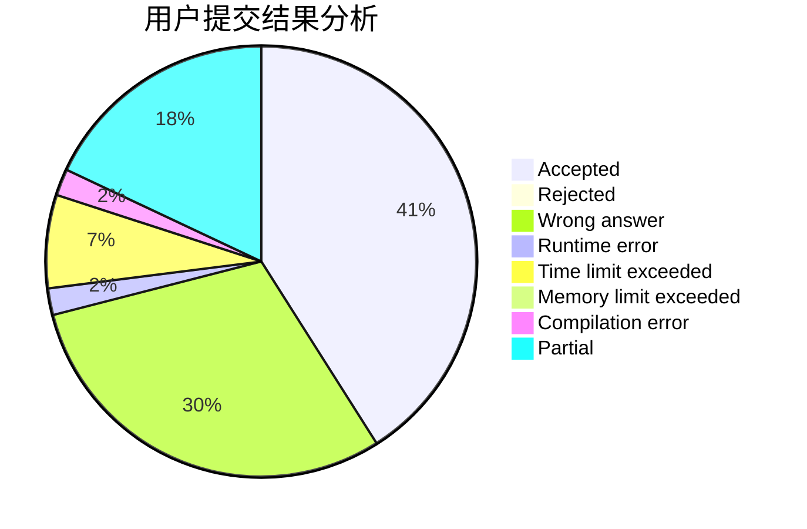
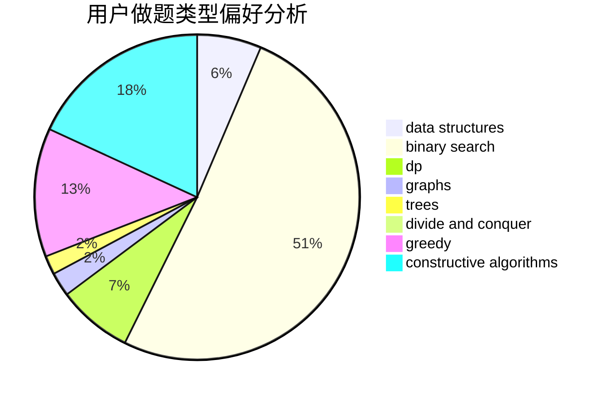
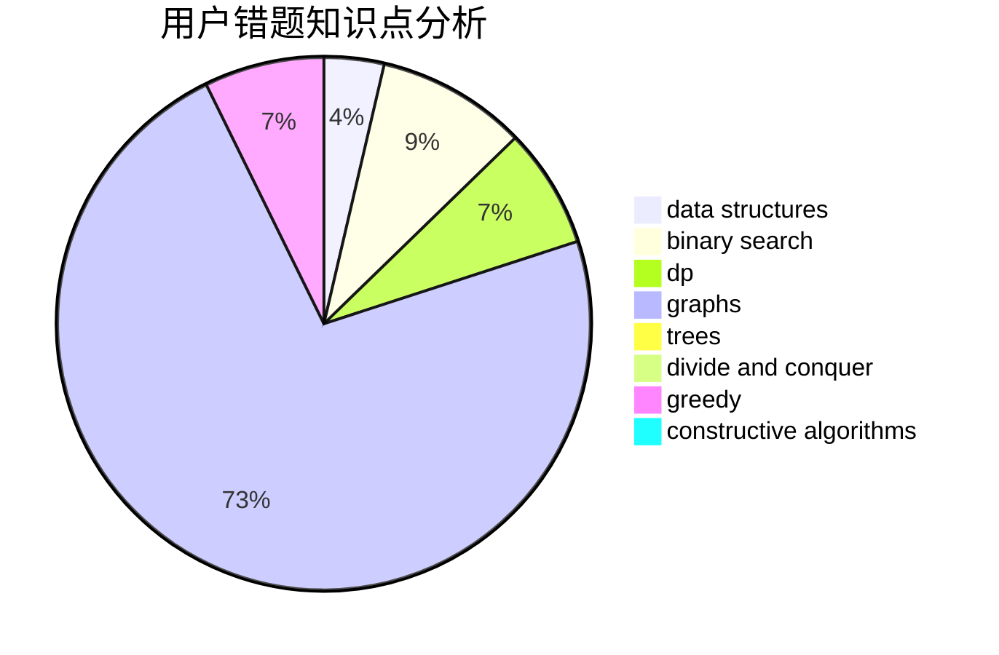

# zmy123456

<!-- tabs:start -->

#### **用户提交结果分析**

#### **用户做题类型偏好分析**

#### **用户错题知识点分析**

<!-- tabs:end -->
# 推荐题目
[911D](https://codeforces.com/contest/911/problem/D)		brute force,
                        math		  
[490F](https://codeforces.com/contest/490/problem/F)		data structures,
                        dfs and similar,
                        dp,
                        trees		  
[15C](https://codeforces.com/contest/15/problem/C)		games		  
[1025F](https://codeforces.com/contest/1025/problem/F)		geometry		  
[437A](https://codeforces.com/contest/437/problem/A)		implementation		  
[828D](https://codeforces.com/contest/828/problem/D)		dsu,graphs,sortings,trees		  
[1234F](https://codeforces.com/contest/1234/problem/F)		bitmasks,
                        dp		  
[1187B](https://codeforces.com/contest/1187/problem/B)		binary search,
                        implementation,
                        strings		  
[258B](https://codeforces.com/contest/258/problem/B)		brute force,
                        combinatorics,
                        dp		  
[402E](https://codeforces.com/contest/402/problem/E)		graphs,
                        math		  
