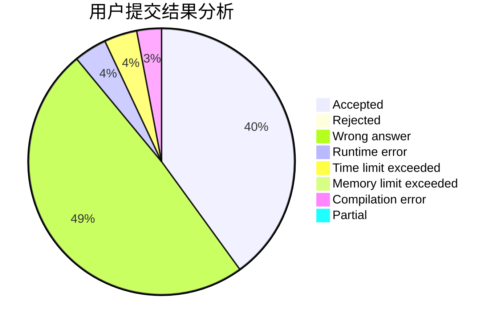
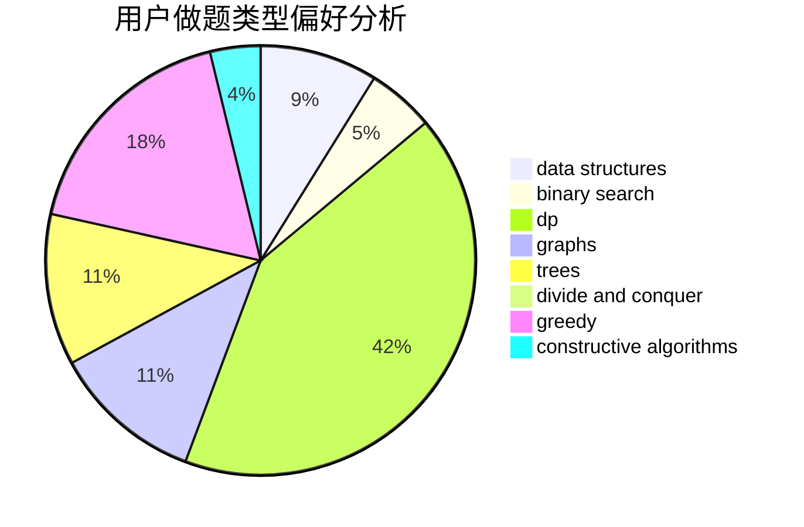

# znmsmg

<!-- tabs:start -->

#### **用户提交结果分析**

#### **用户做题类型偏好分析**

#### **用户错题知识点分析**

<!-- tabs:end -->
# 推荐题目
[1471F](https://codeforces.com/contest/1471/problem/F)		dsu,graphs,sortings,trees		  
[1153A](https://codeforces.com/contest/1153/problem/A)		brute force,
                        math		  
[320B](https://codeforces.com/contest/320/problem/B)		dfs and similar,
                        graphs		  
[780B](https://codeforces.com/contest/780/problem/B)		binary search		  
[305D](https://codeforces.com/contest/305/problem/D)		combinatorics,
                        math		  
[747D](https://codeforces.com/contest/747/problem/D)		dp,
                        greedy,
                        sortings		  
[1249C1](https://codeforces.com/contest/1249C/problem/1)		brute force,
                        greedy,
                        implementation		  
[25E](https://codeforces.com/contest/25/problem/E)		hashing,
                        strings		  
[1130D2](https://codeforces.com/contest/1130D/problem/2)		dsu,graphs,sortings,trees		  
[616F](https://codeforces.com/contest/616/problem/F)		string suffix structures,
                        strings		  
