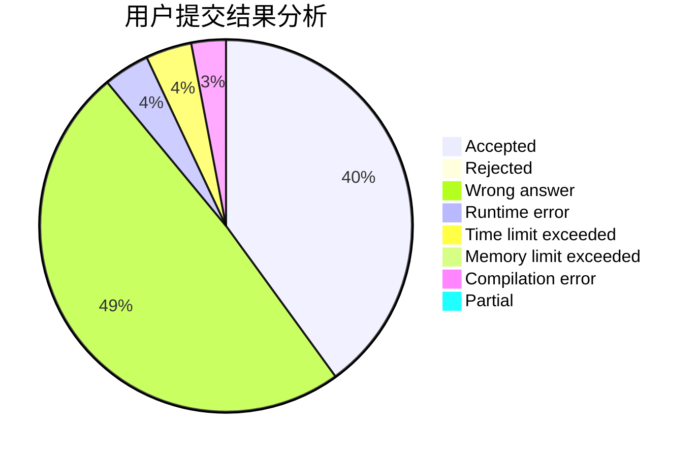
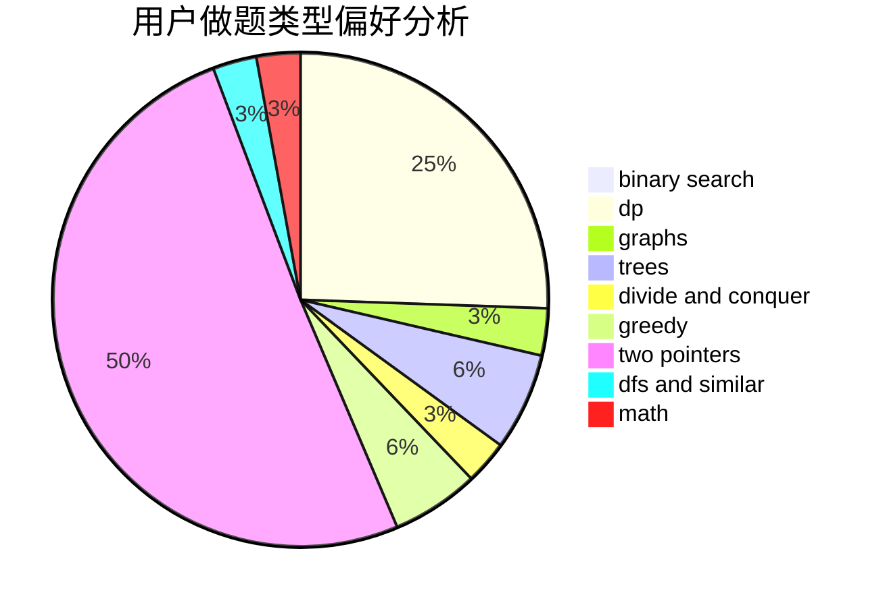

# znmsmg

<!-- tabs:start -->

#### **用户提交结果分析**

#### **用户做题类型偏好分析**

<!-- tabs:end -->
# 推荐题目
[14802](https://codeforces.com/contest/1480/problem/2)
[1155A](https://codeforces.com/contest/1155/problem/A)
[351C](https://codeforces.com/contest/351/problem/C)
[798E](https://codeforces.com/contest/798/problem/E)
[327A](https://codeforces.com/contest/327/problem/A)
[767A](https://codeforces.com/contest/767/problem/A)
[1252L](https://codeforces.com/contest/1252/problem/L)
[277E](https://codeforces.com/contest/277/problem/E)
[1132E](https://codeforces.com/contest/1132/problem/E)
[634D](https://codeforces.com/contest/634/problem/D)
